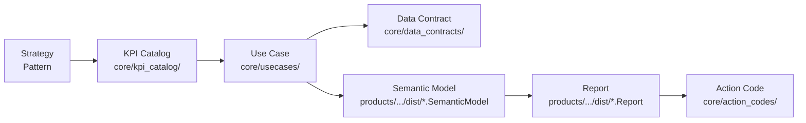

# Architecture Overview

This document provides the mental model for the repository structure. Read it alongside [`ONBOARDING.md`](../../ONBOARDING.md).

---

## The Golden Thread

Every artifact in this repo traces back to a strategic intent through one unbroken chain:



No artifact re-defines what another artifact has already defined. KPI meaning lives only in the KPI catalog. Action logic lives only in action codes. Reports and use cases reference — they never redefine.

---

## Layer Responsibilities

### `core/` — Source of Truth (tool-agnostic)

Defines meaning and governance. Nothing platform-specific lives here.

```
core/
  strategy_operating_model/   # WHY: strategy patterns, operating model, Golden Thread
  usecases/                   # Business decision contexts (Business_Factsheet + UseCase_Bracket.yaml)
  kpi_catalog/                # Governed KPI definitions (golden_20.yaml + extended_playbook.md)
  action_codes/               # Coded recommendations with triggers and execution steps
  semantic_models/            # Measure dictionaries (one per domain) — the bridge to implementation
  data_contracts/             # Silver-layer schemas and source contracts
  templates/                  # Page, measure, data-contract templates
  implementation_guides/      # Step-by-step playbooks
```

**Edit freely.** Changes here trigger Stage 1 validation.

### `products/` — Platform Implementations

Consumes `core/`. Produces platform-specific artifacts. Never defines KPI meaning or action logic.

```
products/
  fabric/powerbi/             # Microsoft Fabric + Power BI (primary implementation)
    orchestrator/             # Generation scripts and orchestration
    tooling/                  # Fabric-specific validators and generators
    dist/                     # GENERATED — TMDL semantic models and PBIR reports
    deployment/               # Fabric workspace and pipeline setup
    docs/                     # Fabric-specific architecture and how-to docs
  open_source_stack/          # Evidence.dev + dbt (OSS alternative)
  oss_adapters/               # Thin adapter stubs for Grafana, Metabase, Superset
```

**`dist/` is generated.** Run `orchestrate_full_model.ps1` to regenerate. Do not edit files under `dist/` manually.

### `tooling/` — Automation and Guardrails

Validates, generates, and governs. Shared across all products.

```
tooling/
  validation/       # Stage 1 check scripts and JSON schemas
  generator/        # TMDL measure generation, use case scaffolding
  ontology/         # Registry builder — builds master_registry.json from all governed artifacts
  linters/          # DAX, TMDL, encoding linters
  tests/            # pytest suite for generators and validators
  run_stage1_checks.ps1
  run_all_checks.ps1
```

### `studio/` — Interaction Layer (UI)

Next.js application for browsing and editing `core/` artifacts visually. Wraps the same YAML/Markdown files.

### `showcases/` — Reference Examples

Worked examples for the Aurora Group demo company. Not delivered to customers; used to validate the full pipeline.

```
showcases/
  aurora_group/
    data/gold/       # Synthetic gold-layer Parquet data
    usecases/        # Aurora-specific use case extensions
```

Semantic models for Aurora are generated into `products/fabric/powerbi/dist/` — not stored in `showcases/`.

### `docs/` — Navigation and Architecture Docs

Entry points for all audiences. The canonical navigation hub is [`docs/README.md`](../README.md).

### `internal/` — Maintainer-Only

Strategy notes, roadmaps, CI specs, archives, and audits. Not relevant for day-to-day development.

---

## Validation Gates

| Gate | Scope | Command |
|---|---|---|
| **Stage 1** (mandatory before merge) | Tool-agnostic: `core/`, `tooling/`, `docs/` | `.\tooling\run_stage1_checks.ps1` |
| **Fabric** | TMDL, DAX, PBIP, measures | `.\products\fabric\powerbi\tooling\run_fabric_checks.ps1` |
| **OSS** | Evidence.dev, dbt, adapters | `bash products/open_source_stack/tooling/run_oss_checks.sh` |
| **Full local** | Stage 1 + Fabric | `.\tooling\run_all_checks.ps1` |

Run all commands from the **repository root**.

---

## Source vs. Generated — Decision Tree

```
Is the file under products/fabric/powerbi/dist/ ?  → GENERATED. Regenerate with orchestrate_full_model.ps1
Is the file under tooling/ontology/out/ ?           → GENERATED. Regenerate with registry_builder.py
Is the file under core/ ?                           → SOURCE. Edit and run Stage 1.
Is the file under products/fabric/powerbi/orchestrator/ or tooling/ ?  → SOURCE. Edit, test, run checks.
```

---

## Further Reading

- [`ONBOARDING.md`](../../ONBOARDING.md) — one-hour walkthrough for new colleagues
- [`core/strategy_operating_model/operating_model/golden_thread_strategy_to_action.md`](../../core/strategy_operating_model/operating_model/golden_thread_strategy_to_action.md) — full Golden Thread narrative
- [`CONTRIBUTING.md`](../../CONTRIBUTING.md) — workflow, conventions, validation gates
- [`GLOSSARY.md`](../../GLOSSARY.md) — TMDL, PBIP, IR, MCP, and other acronyms
- [`TAXONOMY.md`](../../TAXONOMY.md) — ID schemes, domain prefixes, naming rules
