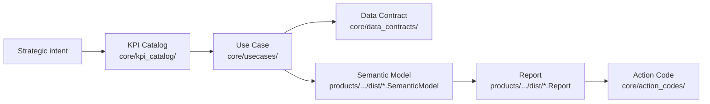

# Architecture Overview

This is the canonical reference for the framework's mental model: the Golden Thread, folder responsibilities, and source-vs-generated rules.

Read it alongside [`ONBOARDING.md`](../../ONBOARDING.md). If you just want to orient quickly, use the "I want to…" navigation at the bottom.

---

## The Golden Thread

Every artifact in this repo traces back to a strategic intent through one unbroken chain. This chain — the **Golden Thread** — has six links:



**In plain language:**

1. A company has a strategic goal.
2. A **KPI** is defined to measure it — exactly once, in the KPI catalog.
3. A **Use Case** frames the business question and references the KPI.
4. A **Data Contract** names the tables and fields the use case needs.
5. A **Semantic Model** translates those fields into calculated measures.
6. A **Report** shows the result and surfaces deviations.
7. When a KPI deviates, an **Action Code** recommends what to do.

**The rule that holds the chain together:** No artifact re-defines what another has already defined. KPI meaning lives only in the KPI catalog. Action logic lives only in action codes. Reports and use cases *reference* — they never redefine.

**Canonical example — COM-001:**

```
Strategy pattern (Margin-First)
  └─ Strategic KPI: margin.gm.pct           [core/kpi_catalog/golden_20.yaml]
       └─ Use Case: COM-001                  [core/usecases/core/COM-001_Sales_Performance/]
            └─ Data contract                 [core/data_contracts/domains/commercial_sales.yaml]
            └─ Measure: Gross Margin %       [products/fabric/powerbi/dist/Commercial.SemanticModel/]
                 └─ Report page              [products/fabric/powerbi/dist/COM-001_Sales_Performance.Report/]
                      └─ Actions: C-M2.1, C-S1.1, C-S1.2  [core/action_codes/Commercial/]
```

**Health scorecard validation (H1 metric):** The automated scorecard checks that every strategic KPI traces through all five layers (catalog → bracket → measure dictionary → data contract → action code). Run `python tooling/health_scorecard.py` to verify.

---

## Layer Responsibilities

### `core/` — Source of Truth (tool-agnostic)

Defines meaning and governance. Nothing platform-specific lives here.

```
core/
  strategy_operating_model/   # WHY: strategy patterns, operating model, Golden Thread
  usecases/                   # Business decision contexts (Business_Factsheet + UseCase_Bracket.yaml)
  kpi_catalog/                # Governed KPI definitions (golden_20.yaml + extended_playbook.md)
  action_codes/               # Coded recommendations with triggers and execution steps
  semantic_models/            # Measure dictionaries (one per domain) — the bridge to implementation
  data_contracts/             # Silver-layer schemas and source contracts
  templates/                  # Page, measure, data-contract templates
  implementation_guides/      # Step-by-step playbooks
```

**Edit freely.** Changes here trigger Stage 1 validation.

### `products/` — Platform Implementations

Consumes `core/`. Produces platform-specific artifacts. Never defines KPI meaning or action logic.

```
products/
  fabric/powerbi/             # Microsoft Fabric + Power BI (primary implementation)
    orchestrator/             # Generation scripts and orchestration
    tooling/                  # Fabric-specific validators and generators
    dist/                     # GENERATED — TMDL semantic models and PBIR reports
    deployment/               # Fabric workspace and pipeline setup
    docs/                     # Fabric-specific architecture and how-to docs
  open_source_stack/          # Evidence.dev + dbt (OSS alternative)
  oss_adapters/               # Thin adapter stubs for Grafana, Metabase, Superset
```

**`dist/` is generated.** Run `orchestrate_full_model.ps1` to regenerate. Do not edit files under `dist/` manually.

### `tooling/` — Automation and Guardrails

Validates, generates, and governs. Shared across all products.

```
tooling/
  validation/       # Stage 1 check scripts and JSON schemas
  generator/        # TMDL measure generation, use case scaffolding
  ontology/         # Registry builder — builds master_registry.json from all governed artifacts
  linters/          # DAX, TMDL, encoding linters
  tests/            # pytest suite for generators and validators
  run_stage1_checks.ps1
  run_all_checks.ps1
```

### `studio/` — Interaction Layer (UI)

Next.js application for browsing and editing `core/` artifacts visually. Wraps the same YAML/Markdown files.

### `showcases/` — Reference Examples

Worked examples for the Aurora Group demo company. Not delivered to customers; used to validate the full pipeline.

```
showcases/
  aurora_group/
    data/gold/       # Synthetic gold-layer Parquet data
    usecases/        # Aurora-specific use case extensions
```

Semantic models for Aurora are generated into `products/fabric/powerbi/dist/` — not stored in `showcases/`.

### `docs/` — Navigation and Architecture Docs

Entry points for all audiences. The canonical navigation hub is [`docs/README.md`](../README.md).

### `internal/` — Maintainer-Only

Strategy notes, roadmaps, CI specs, archives, and audits. Not relevant for day-to-day development.

---

## Validation Gates

| Gate | Scope | Command |
|---|---|---|
| **Stage 1** (mandatory before merge) | Tool-agnostic: `core/`, `tooling/`, `docs/` | `.\tooling\run_stage1_checks.ps1` |
| **Fabric** | TMDL, DAX, PBIP, measures | `.\products\fabric\powerbi\tooling\run_fabric_checks.ps1` |
| **OSS** | Evidence.dev, dbt, adapters | `bash products/open_source_stack/tooling/run_oss_checks.sh` |
| **Full local** | Stage 1 + Fabric | `.\tooling\run_all_checks.ps1` |

Run all commands from the **repository root**.

---

## Source vs. Generated — Decision Tree

```
Is the file under products/fabric/powerbi/dist/ ?  → GENERATED. Regenerate with orchestrate_full_model.ps1
Is the file under tooling/ontology/out/ ?           → GENERATED. Regenerate with registry_builder.py
Is the file under core/ ?                           → SOURCE. Edit and run Stage 1.
Is the file under products/fabric/powerbi/orchestrator/ or tooling/ ?  → SOURCE. Edit, test, run checks.
```

---

## I want to…

| Goal | Where to go |
|---|---|
| Understand the framework from scratch | [`ONBOARDING.md`](../../ONBOARDING.md) — Reader track |
| Find all use cases | [`core/usecases/UseCase_Inventory.md`](../../core/usecases/UseCase_Inventory.md) |
| Read a KPI definition | [`core/kpi_catalog/golden_20.yaml`](../../core/kpi_catalog/golden_20.yaml) |
| Read an action code | [`core/action_codes/<Domain>/`](../../core/action_codes/) |
| Read a data contract | [`core/data_contracts/domains/`](../../core/data_contracts/domains/) |
| Understand a term or acronym | [`GLOSSARY.md`](../reference/GLOSSARY.md) |
| Add a new use case | [`CONTRIBUTING.md`](../../CONTRIBUTING.md) — "Adding a new use case" |
| Run validation | `.\tooling\run_stage1_checks.ps1` (see Validation Gates above) |
| Understand a specific platform (Fabric/Power BI) | [`products/fabric/powerbi/README.md`](../../products/fabric/powerbi/README.md) |
| Fix a validation error | [`internal/project_mgmt/KNOWN_ERRORS_AND_FIXES.md`](../../internal/project_mgmt/KNOWN_ERRORS_AND_FIXES.md) |

## Further Reading

- [`adr/`](adr/README.md) — Architecture Decision Records (significant, immutable decisions)
- [`ONBOARDING.md`](../../ONBOARDING.md) — one-hour walkthrough for new colleagues
- [`core/strategy_operating_model/operating_model/golden_thread_strategy_to_action.md`](../../core/strategy_operating_model/operating_model/golden_thread_strategy_to_action.md) — full Golden Thread narrative
- [`CONTRIBUTING.md`](../../CONTRIBUTING.md) — workflow, conventions, validation gates
- [`GLOSSARY.md`](../reference/GLOSSARY.md) — TMDL, PBIP, IR, MCP, and other acronyms
- [`TAXONOMY.md`](../reference/TAXONOMY.md) — ID schemes, domain prefixes, naming rules
