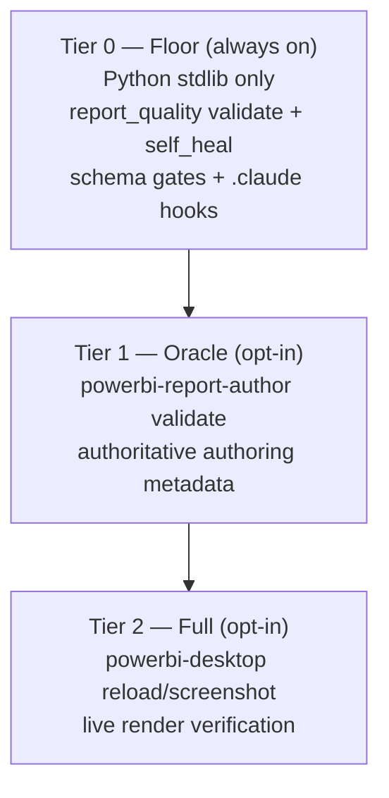

# ADR 0001 — Pluggable Validation Backends and Capability Tiers

- **Status:** Accepted — salvaged via PR #321 (2026-06-16) and CLI-wired via PR #373 (2026-07-08); see "Status update — 2026-07-08" below
- **Date:** 2026-06-10
- **Scope:** Power BI / PBIR report authoring and validation tooling
- **Supersedes:** —
- **Related:** [`quality-tooling-map.md`](../quality-tooling-map.md), [`README.md`](../README.md), [`../r3-1-tooling-audit-and-theme-decision.md`](../r3-1-tooling-audit-and-theme-decision.md)

---

## Status update — 2026-07-08

The "deferred, not adopted" status below is **stale**. One day after that
2026-06-15 update, PR #321 (`feat(pbi-quality): pluggable validation backends
+ capability tiers (ADR-0001 impl, salvaged)`) merged the backend/tier
scaffolding to `main` after all — `tooling/report_quality/backends.py`'s
`NativeBackend` (Tier 0) and `MicrosoftReportAuthorBackend` (Tier 1) have
been real, present code on `main` since 2026-06-16, correctly gated behind
`PBI_QUALITY_ALLOW_EXTERNAL` exactly as designed below.

What the salvage PR left incomplete: `tooling/report_quality/cli.py` (the
entry point `report_quality.cli --summary` / `pbi-quality validate` actually
call) never imported `backends.py`. `pbi-quality doctor` correctly reported
the active tier, but Tier 1 findings never flowed into the returned
violations list — step 2 of this ADR's own "Implementation notes" was never
finished. Every "0 critical/warning/info" result from the CLI reflected only
the Tier 0 floor; nobody had run the Tier 1 path with the flag set to notice.

Fixed in PR #373: `MicrosoftReportAuthorBackend().validate(dist_root)` is now
called from `validate()` in `cli.py`. The class handles opt-in gating and
graceful skip entirely on its own, so this is a safe, one-line addition —
default (unopted) behavior is unchanged and verified so.

**Status is now `Accepted`.** Full audit, theme-name-conflict resolution
(#7), and a triage of what the now-active Tier 1 oracle found across the
repo: [`r3-1-tooling-audit-and-theme-decision.md`](../r3-1-tooling-audit-and-theme-decision.md).

---

## Status update — 2026-06-15

This proposal was **prototyped end-to-end** in PR #282 (branch
`claude/youthful-keller-uuj25o`): a Tier-0 `NativeBackend` plus a Tier-1
`MicrosoftReportAuthorBackend`, the vendored authoring-metadata snapshot, and
the diagnostics parser — all behind a default-off `PBI_QUALITY_ALLOW_EXTERNAL`
switch, exactly as designed below.

**Decision: deferred — not adopted for the current direction.** The full
pluggable-backend framework is heavier surface than the project needs today, so
PR #282 was **closed unmerged**. (The prototype branch had also fallen ~40k
lines behind `main`, where a direct merge would have reverted #304–#307.)

The one concrete correctness win the spike surfaced **was kept**: generated
`textbox` visuals emitted an invalid empty `Data` queryState
(`PBIR_ROLE_UNKNOWN` — textboxes take no data roles). That fix — the
`page_builder.py` emitter change plus the deterministic, dependency-free
no-data-role guard in `visual_validator.py` — was extracted to **PR #308 and
merged to `main`**, without any of the snapshot/backend machinery.

This ADR is **retained as a parked proposal** so the design is not lost. The
full prototype remains available on the closed PR #282 /
`claude/youthful-keller-uuj25o` branch for reference. Revisit by re-extracting
the framework cleanly off `main` and moving this ADR to `Accepted`, or by
superseding it with a new ADR.

---

## Context

Microsoft and the wider Fabric ecosystem now ship official, headless,
agent-oriented authoring and validation tooling that overlaps the core of
our home-grown Power BI stack:

- **`@microsoft/powerbi-report-authoring-cli`** (`powerbi-report-author`) —
  edits and validates PBIR, and exposes authoring metadata
  (`catalog describe`, `formatting list-objects`, `formatting describe-object`)
  as the authoritative source for visual types, query roles, property keys,
  and enum values.
- **`@microsoft/powerbi-desktop-bridge-cli`** (`powerbi-desktop`) — reloads
  PBIP into Desktop, captures screenshots, reports bridge status.
- **Remote Power BI MCP Server** (Entra-authenticated) — schema, DAX
  generation, and query execution for agents and MCP clients.
- Microsoft's `skills-for-fabric` defines an official `SKILL.md` format and
  skill catalogue for exactly our domain.

This overlaps our own code directly: the `powerbi-report-author validate`
command covers the same ground as `tooling/report_quality/`, and its
metadata commands provide an authoritative replacement for the **hard-coded
queryState role logic** in `visual_builder.py` / `visual_validator.py` —
which is the single most frequent error class in
`KNOWN_ERRORS_AND_FIXES.md` ("queryState falsch").

The opportunity is real, but so is a constraint: **not every customer trusts
third-party installations.** Customer environments vary widely:

- Air-gapped or no access to the public npm registry.
- Software whitelisting that forbids unapproved binaries (a preview
  `v0.1.0` package installed via `npm install -g` will not pass review).
- No Node.js toolchain permitted at all.
- "Bring your own tools" — an already-sanctioned PBI toolchain (Tabular
  Editor, `pbi-tools`, DAX Studio) that they do not want to extend.
- Inversely: customers who trust **only** Microsoft-signed tooling and are
  wary of our home-grown Python.

We must adopt the official tooling where it strengthens us **without** making
it a hard dependency, and without weakening the parts of our stack that make
us deployable in locked-down environments.

We already have precedent for the pattern this ADR formalises:
`check_with_pbi_cli.ps1` runs `pbir validate --qa` and **skips gracefully**
when the CLI is absent; the `check_pbi_desktop.sh` hook is **opportunistic
and advisory**; and `pbi-quality doctor` already reports environment state.

---

## Decision

Treat every external tool as an **optional oracle, never a hard dependency.**
Validation and authoring metadata are resolved through **pluggable backends**
organised into **capability tiers**, with a pure-Python floor that is always
fully functional.

Three hard rules govern the design:

1. **Tier 0 (the Python floor) is always complete.** No external software,
   no Node, no network, no Desktop is ever required for full validation and
   deterministic self-heal. This floor is what makes us deployable in
   locked-down customer environments.
2. **Authoritative metadata is consumed from a vendored snapshot, not from a
   runtime CLI call.** We run the official CLI once in *our* pipeline and
   commit the result as data the generator reads.
3. **The default configuration touches nothing external.** Every external
   call (CLI, Desktop, network, MCP) is explicit opt-in, so a security review
   can verify "out of the box, this tool runs no foreign binaries and makes
   no outbound calls."

---

## Capability tiers

| Tier | Requires | What runs | Target customer |
|---|---|---|---|
| **0 — Floor** | Python (stdlib) | `pbi-quality validate` + `self_heal` + `.claude` hooks + schema gates | air-gapped, no-Node, compliance-locked |
| **1 — Oracle** | `powerbi-report-author` on PATH (opt-in) | official `validate` + metadata as authoritative augmentation | Microsoft-first, npm permitted |
| **2 — Full** | + Power BI Desktop + Node (opt-in) | Desktop reload / screenshot / render verification | developer workstations |

`pbi-quality doctor` reports which tier is active so behaviour is never a
silent surprise.

---

## The metadata snapshot pattern

This is the mechanism that resolves the trust conflict.

The authoritative queryState roles, property keys, and enum values come from
`powerbi-report-author ... describe-object` / `catalog describe`. **We** run
the CLI **once in our own CI** and **vendor the result as JSON** into the
repo, alongside `tooling/schemas/pbir/schema_manifest.json`. Then:

- **No-install customer:** the generator reads the vendored metadata snapshot
  and gets authoritative roles **without Node or the CLI on site.** The
  queryState error class disappears regardless of their environment.
- **Us:** we refresh the snapshot in *our* trusted pipeline whenever the CLI
  is bumped, the same way `discover_schema_latest.py` refreshes pinned
  schemas.

This decouples "authoritative truth" from "runtime dependency on a foreign
binary." The third-party software runs only inside our trusted environment;
the customer receives reviewable, signable JSON.

---

## Pluggable backend interface

Validation is abstracted behind a small backend contract, mirroring the
existing `products/oss_adapters/` adapter pattern:

- **`NativeBackend`** — pure Python, always present (Tier 0).
- **`MicrosoftCliBackend`** — wraps `powerbi-report-author` when on PATH
  (Tier 1). This extends the existing `check_with_pbi_cli.ps1` precedent.
- **`PbiToolsBackend`** *(optional, future)* — for customers already
  standardised on `pbi-tools` / Tabular Editor.

Backends are discovered by capability probe (the `doctor` mechanism) and are
never imported unless present. `pbi_quality_tools` stays strictly
zero-runtime-dependency (stdlib only); any external integration ships as an
optional extra, never on the import path of the floor.

---

## Compliance mode (default)

The shipped default is "compliance mode": external backends are **off** until
explicitly enabled by flag or environment variable. Enabling Tier 1/2 is a
deliberate, auditable choice. For environments where npm is permitted but
strict, the recommended posture is project-local + version-pinned installs
via an internal mirror (for example Azure Artifacts) rather than a global
`npm install -g` of a preview package — or, preferably, no install at the
customer at all via the snapshot pattern above.

---

## What we keep vs. what we adopt

We keep only our **better additions** — the parts the official tooling does
not cover and that constitute our moat:

| Keep (our moat — never outsourced) | Adopt as opt-in backend / data |
|---|---|
| `UseCase_Bracket.yaml` → report mapping | `powerbi-report-author validate` as an extra gate |
| Golden Thread / KPI catalog binding | authoritative authoring metadata (via snapshot) |
| 3-30-300 page specs and page templates | `powerbi-desktop` render verification (Tier 2) |
| TMDL generation (explicitly out of scope for the MS skill) | — |
| `.claude` hooks, schema gates, learning loop | Remote PBI MCP Server (Tier 1/2, CI without Desktop) |

The semantic-model / TMDL layer remains entirely ours: the Microsoft
authoring skill covers PBIR reports only, not the model.

---

## Consequences

**Positive**

- Deployable everywhere: the Tier 0 floor needs nothing external, so
  locked-down and air-gapped customers get full validation and self-heal.
- The queryState error class is eliminated for *all* customers via the
  vendored metadata snapshot, with no per-customer toolchain requirement.
- Trust cuts both ways and becomes a selling point: we run on the customer's
  sanctioned toolchain — nothing-but-Python, the official MS CLI, or their
  existing `pbi-tools` / Tabular Editor.
- Security review is trivial by default: no foreign binaries, no outbound
  calls unless opted in.

**Negative / cost**

- Two code paths to maintain (native floor and optional backend) plus a
  snapshot-refresh job in our CI.
- The metadata snapshot can lag the latest CLI until refreshed; the floor
  remains the source of truth between refreshes.

**Neutral**

- Node 20 becomes an optional, opt-in toolchain (Tier 1/2), never a base
  requirement.
- Whether `powerbi-desktop` can run headless / on Linux is still to be
  verified; it is confined to opt-in Tier 2 until confirmed.

---

## Alternatives considered

- **Replace the home-grown stack with the official CLI.** Rejected: creates a
  hard third-party dependency that breaks no-install and air-gapped
  customers, and bets on a `v0.1.0` preview package.
- **Ignore the official tooling and keep everything home-grown.** Rejected:
  forgoes the authoritative metadata that eliminates our top error class, and
  drifts against an emerging official standard.
- **Call the CLI at customer runtime for metadata.** Rejected in favour of the
  snapshot pattern, which keeps the foreign binary inside our trusted
  pipeline and ships only reviewable data to the customer.

---

## Implementation notes

Incremental, floor-first; nothing below weakens Tier 0.

1. **Spike / proof of concept.** Run `powerbi-report-author validate` against
   an existing `products/fabric/powerbi/dist/*.Report` directory and diff the
   findings against `pbi-quality validate` to produce a fact-based adopt
   decision.
2. **Backend contract.** Introduce the backend interface and refactor
   `check_with_pbi_cli.ps1` into the `MicrosoftCliBackend` shape; keep
   graceful-skip semantics.
3. **Metadata snapshot.** Add a CI job that runs the CLI metadata commands and
   vendors the output next to `schema_manifest.json`; point `visual_builder.py`
   at the snapshot instead of hard-coded role tables.
4. **Compliance flag.** Add the default-off external switch and surface the
   active tier in `pbi-quality doctor`.
5. **Skill format alignment.** Mirror the official `SKILL.md` front matter
   (`name`, `description`, `metadata.version`, trigger phrases) in
   `docs/agent/skills/`.

---

## References

- Microsoft `skills-for-fabric` — `powerbi-report-authoring/SKILL.md` (CLI setup)
- Microsoft Learn — Create and edit Power BI reports with Copilot
- Microsoft Learn — Power BI data in Fabric Apps (preview) / data app template
- Tabular Editor — Fixing a broken Power BI report with AI
- Tabular Editor — Fabric Apps explained: Visualization as code
- PBI-Guy — Power BI Optimization Skill
- Internal: [`quality-tooling-map.md`](../quality-tooling-map.md),
  `check_with_pbi_cli.ps1`, `.claude/hooks/check_pbi_desktop.sh`,
  `packages/pbi_quality_tools` (`doctor`)
