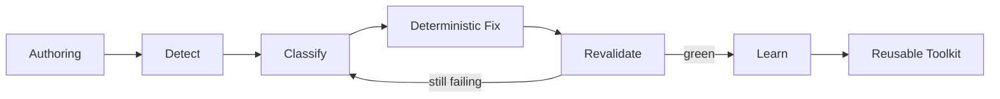

# Quality Tooling Map

> **Auto-generated** from [`tooling/quality/tooling_manifest.yaml`](../../tooling/quality/tooling_manifest.yaml).
> Manifest version: 1.0. Regenerate with `python tooling/quality/generate_quality_tooling_map.py`.
> Do NOT edit this file manually.

## Flowchart

## Gates (Orchestration Entry Points)

| ID | Entrypoint | Scope | Runs In | Description |
|---|---|---|---|---|
| `quality_gate` | [`tooling/quality/run_quality_gate.ps1`](tooling/quality/run_quality_gate.ps1) | `all` | `pwsh` | Canonical local + CI entry point. Runs Stage 1 + Fabric checks. -SelfHeal for local repair loop. -- summary: `-Summary` |
| `stage1_gate` | [`tooling/run_stage1_checks.ps1`](tooling/run_stage1_checks.ps1) | `governance` | `pwsh` | Governance, docs, YAML, registry, markdownlint. |
| `fabric_gate` | [`products/fabric/powerbi/tooling/run_fabric_checks.ps1`](products/fabric/powerbi/tooling/run_fabric_checks.ps1) | `report` | `pwsh` | TMDL, PBIR, pbir-cli --qa, fab-inspector BPA rules, report scorecard, P0 report quality, bindings. |

## Validators

| ID | Entrypoint | Scope | Runs In | Description |
|---|---|---|---|---|
| `report.schema` | [`tooling/report_quality/schema_validator.py`](tooling/report_quality/schema_validator.py) | `report` | `python` | Validates $schema URLs in PBIR JSON files against the schema registry. |
| `report.structural` | [`tooling/report_quality/structural_validator.py`](tooling/report_quality/structural_validator.py) | `report` | `python` | Checks page size, required visual slots, forbidden visual types, visual bounds. |
| `report.content` | [`tooling/report_quality/content_validator.py`](tooling/report_quality/content_validator.py) | `report` | `python` | Checks KPI card presence, date slicer, titles, and display names. |
| `report.dax_refs` | [`tooling/report_quality/dax_reference_validator.py`](tooling/report_quality/dax_reference_validator.py) | `report` | `python` | Validates that all measure references in visuals resolve to known TMDL measures. |
| `pbir.schema` | [`products/fabric/powerbi/tooling/validation/check_pbir_schema.ps1`](products/fabric/powerbi/tooling/validation/check_pbir_schema.ps1) | `report` | `pwsh` | Validates PBIR JSON schema URLs, folder names (page/visual/bookmark), and $schema fields. |
| `pbir.schema_versions` | [`products/fabric/powerbi/tooling/validation/check_schema_versions.py`](products/fabric/powerbi/tooling/validation/check_schema_versions.py) | `report` | `python` | Checks that all $schema URLs in dist/ match the pinned versions in schema_registry.py. |
| `pbir.jsonschema` | [`products/fabric/powerbi/tooling/validation/validate_pbir_jsonschema.py`](products/fabric/powerbi/tooling/validation/validate_pbir_jsonschema.py) | `report` | `python` | Full JSON schema validation against Microsoft PBIR schemas (fetched/cached). |
| `pbir.report_quality_ps1` | [`products/fabric/powerbi/tooling/validation/check_report_quality.ps1`](products/fabric/powerbi/tooling/validation/check_report_quality.ps1) | `report` | `pwsh` | PowerShell wrapper that invokes the Python report_quality CLI within Fabric checks. |
| `pbir.report_scorecard` | [`products/fabric/powerbi/tooling/validation/check_report_scorecard.ps1`](products/fabric/powerbi/tooling/validation/check_report_scorecard.ps1) | `report` | `pwsh` | IBCS scorecard (R3.3): weighted points (100 - severity-weighted deductions) + Mixed-Scale/Unsorted-Evidence knock-outs, threshold 70%. Only -Enforce report(s) (default COM-002) fail the gate; others are scored/logged only pending R5.1 rollout. |
| `pbir.report_pages` | [`products/fabric/powerbi/tooling/validation/check_pbip_report_pages.ps1`](products/fabric/powerbi/tooling/validation/check_pbip_report_pages.ps1) | `report` | `pwsh` | Checks that every report has the required Overview and Detail pages. |
| `pbir.report_layout` | [`products/fabric/powerbi/tooling/validation/check_report_layout.ps1`](products/fabric/powerbi/tooling/validation/check_report_layout.ps1) | `report` | `pwsh` | Validates report visual layout against page template specs. |
| `pbir.page_template` | [`products/fabric/powerbi/tooling/validation/check_page_template_compliance.py`](products/fabric/powerbi/tooling/validation/check_page_template_compliance.py) | `report` | `python` | Checks page template slot/visual-type compliance against UseCase_Bracket.yaml. |
| `pbir.theme` | [`products/fabric/powerbi/tooling/validation/check_report_theme_compliance.py`](products/fabric/powerbi/tooling/validation/check_report_theme_compliance.py) | `report` | `python` | Validates report theme.json against the canonical brand theme. |
| `pbir.actioncode_to_report` | [`products/fabric/powerbi/tooling/validation/check_actioncode_to_report.ps1`](products/fabric/powerbi/tooling/validation/check_actioncode_to_report.ps1) | `report` | `pwsh` | Verifies action code references in reports match orchestration definitions. |
| `tmdl.syntax` | [`products/fabric/powerbi/tooling/validation/check_tmdl_syntax.ps1`](products/fabric/powerbi/tooling/validation/check_tmdl_syntax.ps1) | `model` | `pwsh` | TMDL syntax checks: tabs, assignment operators, M-expression/table-name collision. |
| `tmdl.pbip_readiness` | [`products/fabric/powerbi/tooling/validation/check_tmdl_pbip_readiness.ps1`](products/fabric/powerbi/tooling/validation/check_tmdl_pbip_readiness.ps1) | `model` | `pwsh` | PBIP Desktop-readiness: auto-date tables, isAvailableInMDX, wide tables (>100 cols). |
| `tmdl.diagram_layout` | [`products/fabric/powerbi/tooling/validation/check_diagram_layout.ps1`](products/fabric/powerbi/tooling/validation/check_diagram_layout.ps1) | `model` | `pwsh` | Validates diagramLayout.json (spaghetti-principle position rules). |
| `tmdl.vs_measure_dict` | [`products/fabric/powerbi/tooling/validation/check_tmdl_vs_measure_dictionary.ps1`](products/fabric/powerbi/tooling/validation/check_tmdl_vs_measure_dictionary.ps1) | `model` | `pwsh` | Diffs TMDL measures against the Measure Dictionary XLSX for gaps. |
| `tmdl.measures_vs_kpi` | [`products/fabric/powerbi/tooling/validation/check_measures_vs_kpi.ps1`](products/fabric/powerbi/tooling/validation/check_measures_vs_kpi.ps1) | `model` | `pwsh` | Checks that all TMDL measures align with KPI catalog definitions. |
| `tmdl.dax_bpa` | [`products/fabric/powerbi/tooling/validation/check_dax_best_practices.ps1`](products/fabric/powerbi/tooling/validation/check_dax_best_practices.ps1) | `model` | `pwsh` | Runs DAX Best Practice Analyzer rules from tooling/linters/powerbi/bpa-rules-dax.json. |
| `tmdl.with_pbi_cli` | [`products/fabric/powerbi/tooling/validation/check_with_pbi_cli.ps1`](products/fabric/powerbi/tooling/validation/check_with_pbi_cli.ps1) | `model` | `pwsh` | Runs pbir validate --qa against each .Report directory. |
| `pbir.fab_inspector` | [`products/fabric/powerbi/tooling/validation/check_fab_inspector.ps1`](products/fabric/powerbi/tooling/validation/check_fab_inspector.ps1) | `report` | `pwsh` | Runs fab-inspector (PBI-Inspector V2) against fab-inspector-rules.json; logType:error rules block the gate. See docs/architecture/r3-2-fab-inspector-integration.md. |
| `gov.kpi_catalog` | [`tooling/check_kpi_catalog_gaps.py`](tooling/check_kpi_catalog_gaps.py) | `kpi` | `python` | Checks for gaps and inconsistencies in the KPI catalog. |
| `gov.docs_links` | [`tooling/validation/check_docs_links.py`](tooling/validation/check_docs_links.py) | `governance` | `python` | Validates documentation links and detects deprecated path references. |
| `gov.markdownlint` | [`tooling/validation/check_markdownlint.ps1`](tooling/validation/check_markdownlint.ps1) | `governance` | `pwsh` | Runs markdownlint-cli2 with rules MD010 (tabs), MD041 (first heading), MD047 (final newline). |

## Self-Heal Scripts

| ID | Entrypoint | Scope | Runs In | Description |
|---|---|---|---|---|
| `self_heal.report_quality` | [`tooling/report_quality/self_heal.py`](tooling/report_quality/self_heal.py) | `report` | `python` | Deterministic check->fix->revalidate loop. Max iterations capped. Writes fix_log.json. -- fixes: `page:size`, `visual:bounds`, `schema:url` |
| `self_heal.repair_ps1` | [`products/fabric/powerbi/tooling/validation/repair_report_quality.ps1`](products/fabric/powerbi/tooling/validation/repair_report_quality.ps1) | `report` | `pwsh` | PowerShell wrapper for the Python self-heal CLI. Writes fix log to internal/metrics/runs/. -- fixes: `page:size`, `visual:bounds`, `schema:url` |
| `self_heal.tmdl_render` | [`products/fabric/powerbi/tooling/tmdl_render_and_fix.ps1`](products/fabric/powerbi/tooling/tmdl_render_and_fix.ps1) | `model` | `pwsh` | Normalises TMDL indentation, removes BOM, fixes common syntax errors. -- fixes: `tmdl.syntax` |

## Schema Sources

| ID | Entrypoint | Scope | Runs In | Description |
|---|---|---|---|---|
| `schema.registry` | [`products/fabric/powerbi/tooling/schema_registry.py`](products/fabric/powerbi/tooling/schema_registry.py) | `report` | `python` | Pinned PBIR/PBIP schema URLs. Updated by discover_schema_latest.py when versions change. |
| `schema.discover` | [`products/fabric/powerbi/tooling/discover_schema_latest.py`](products/fabric/powerbi/tooling/discover_schema_latest.py) | `report` | `python` | Discovers latest Microsoft schema versions from GitHub; caches locally; flags drift. -- summary: `--summary` |
| `schema.pbir_resolver` | [`products/fabric/powerbi/tooling/validation/pbir_schema_resolver.py`](products/fabric/powerbi/tooling/validation/pbir_schema_resolver.py) | `report` | `python` | Resolves $ref chains in Microsoft PBIR JSON schemas; caches fetched schemas locally. |
| `schema.cached_fetch` | [`products/fabric/powerbi/tooling/cache_pbir_schemas.py`](products/fabric/powerbi/tooling/cache_pbir_schemas.py) | `report` | `python` | Pre-fetches and caches all pinned Microsoft PBIR schemas to tooling/schemas/pbir/. |

## Agent Skills

| ID | Entrypoint | Scope | Runs In | Description |
|---|---|---|---|---|
| `skill.fabric_pbi_validation` | [`docs/agent/skills/fabric-powerbi-validation.md`](docs/agent/skills/fabric-powerbi-validation.md) | `report` | `markdown` | Guides validation of TMDL, PBIR, DAX, and measures. Run before every Fabric commit. |
| `skill.generate_validate_pbi` | [`docs/agent/skills/generate-and-validate-pbi-report.md`](docs/agent/skills/generate-and-validate-pbi-report.md) | `report` | `markdown` | Full skill for generating Power BI reports with iterative quality validation. |
| `skill.fix_pbi_report_errors` | [`docs/agent/skills/fix-pbi-report-errors.md`](docs/agent/skills/fix-pbi-report-errors.md) | `report` | `markdown` | Diagnose and fix Power BI report and semantic model errors systematically. |
| `skill.stage1_precommit` | [`docs/agent/skills/stage1-pre-commit.md`](docs/agent/skills/stage1-pre-commit.md) | `governance` | `markdown` | Run Stage 1 checks before committing. References quality_gate. |
| `skill.fix_stage1_failure` | [`docs/agent/skills/fix-stage1-failure.md`](docs/agent/skills/fix-stage1-failure.md) | `governance` | `markdown` | Diagnose and fix Stage 1 CI failures. |

## PostToolUse Hooks

| ID | Entrypoint | Scope | Runs In | Description |
|---|---|---|---|---|
| `hook.validate_tmdl_style` | [`.claude/hooks/validate_tmdl_style.sh`](.claude/hooks/validate_tmdl_style.sh) | `model` | `bash` | PostToolUse hook: blocks on tab/`:=`/`description:` violations in .tmdl files. |
| `hook.validate_pbir_structure` | [`.claude/hooks/validate_pbir_structure.sh`](.claude/hooks/validate_pbir_structure.sh) | `report` | `bash` | PostToolUse hook: blocks on JSON syntax errors in .json/.pbir inside PBIP directories. |
| `hook.validate_measure_metadata` | [`.claude/hooks/validate_measure_metadata.sh`](.claude/hooks/validate_measure_metadata.sh) | `model` | `bash` | PostToolUse hook: enforces formatString, displayFolder, /// Purpose: on _Measures.tmdl. |
| `hook.check_pbi_desktop` | [`.claude/hooks/check_pbi_desktop.sh`](.claude/hooks/check_pbi_desktop.sh) | `report` | `bash` | PostToolUse hook: opportunistic advisory if Power BI Desktop is running (pbir validate --fields). |

## BPA Rule Sets

| ID | Entrypoint | Scope | Runs In | Description |
|---|---|---|---|---|
| `bpa.dax` | [`tooling/linters/powerbi/bpa-rules-dax.json`](tooling/linters/powerbi/bpa-rules-dax.json) | `model` | `json` | DAX best practice rules: dax.ifnesting.avoid, dax.format.forbidden (with allowWhenContains). |
| `bpa.tmdl` | [`tooling/linters/powerbi/bpa-rules-tmdl.json`](tooling/linters/powerbi/bpa-rules-tmdl.json) | `model` | `json` | TMDL structural rules: summarizeBy:none, tabs, no := operator. |
| `bpa.report` | [`tooling/linters/powerbi/bpa-rules-report.json`](tooling/linters/powerbi/bpa-rules-report.json) | `report` | `json` | Report-level rules: forbidden visuals, slot requirements. |
| `bpa.semanticmodel` | [`tooling/linters/powerbi/bpa-rules-semanticmodel.json`](tooling/linters/powerbi/bpa-rules-semanticmodel.json) | `model` | `json` | Semantic model best practices: isAvailableInMDX, hidden columns, auto date tables. |
| `bpa.fab_inspector` | [`products/fabric/powerbi/tooling/validation/fab-inspector-rules.json`](products/fabric/powerbi/tooling/validation/fab-inspector-rules.json) | `report` | `json` | JSON-Logic rules for the fab-inspector (PBI-Inspector V2) engine: max visuals/page, no vertical scroll, theme-colour hygiene. All logType:error. |

## Reference Documentation

| ID | Entrypoint | Scope | Runs In | Description |
|---|---|---|---|---|
| `ref.tmdl_allowed_subset` | [`core/strategy_operating_model/operating_model/reference/TMDL_Allowed_Subset.md`](core/strategy_operating_model/operating_model/reference/TMDL_Allowed_Subset.md) | `model` | `markdown` | Canonical TMDL conventions: tabs, DAX assignment, measure docs, summarizeBy, layout. |
| `ref.pbir_visual_json` | [`products/fabric/powerbi/docs/references/pbir-visual-json.md`](products/fabric/powerbi/docs/references/pbir-visual-json.md) | `report` | `markdown` | Editing visual.json: position, expressions, data binding. |
| `ref.pbir_schemas_versions` | [`products/fabric/powerbi/docs/references/pbir-schemas-versions.md`](products/fabric/powerbi/docs/references/pbir-schemas-versions.md) | `report` | `markdown` | PBIR schema version history and migration patterns. |
| `ref.pbir_conditional_formatting` | [`products/fabric/powerbi/docs/references/pbir-conditional-formatting.md`](products/fabric/powerbi/docs/references/pbir-conditional-formatting.md) | `report` | `markdown` | Adding measure-based, gradient, or rules-based conditional formatting. |
| `ref.pbir_filter_pane` | [`products/fabric/powerbi/docs/references/pbir-filter-pane.md`](products/fabric/powerbi/docs/references/pbir-filter-pane.md) | `report` | `markdown` | Filter pane and filter structure reference for PBIR. |
| `ref.pbir_fix_broken_refs` | [`products/fabric/powerbi/docs/references/pbir-fix-broken-field-references.md`](products/fabric/powerbi/docs/references/pbir-fix-broken-field-references.md) | `report` | `markdown` | Step-by-step guide for fixing broken field references in PBIR reports. |
| `ref.known_errors` | [`internal/project_mgmt/KNOWN_ERRORS_AND_FIXES.md`](internal/project_mgmt/KNOWN_ERRORS_AND_FIXES.md) | `all` | `markdown` | Human-readable knowledge base of known errors, causes, and fixes. Machine version: tooling/quality/known_errors.yaml. |
| `ref.quality_tooling_map` | [`docs/architecture/quality-tooling-map.md`](docs/architecture/quality-tooling-map.md) | `all` | `markdown` | Generated map of all quality tooling. DO NOT edit manually -- regenerate with generate_quality_tooling_map.py. |

---

*Generated by `generate_quality_tooling_map.py`. Edit `tooling_manifest.yaml` to change this file.*
