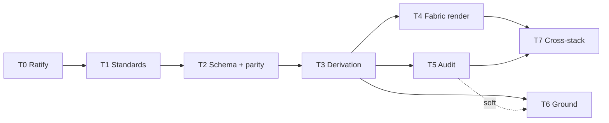

# Architecture Blueprint — Build Backlog & Loop Plan (draft)

> **Status:** Draft plan (no code). Companion to `architecture-blueprint-ir-spec.md`
> (the contract) and to ALUCA `ADR-0015` / Freelancing
> `2026-07-15_onelake-ai-era-blueprint-alignment.md` (the why).
>
> **MIRROR — field-identical across both repos** (ADR-0005 discipline; same as the IR
> spec). This file is byte-identical in ALUCA (`docs/architecture/research/`) and
> Freelancing (`meridian/docs/research/reporting-platform-blueprints/`). Task **cards,
> DoDs, roles and the loop protocol are shared**; per-repo divergence is noted inline
> in each card (ALUCA extends Superversion; Meridian extends `dataarch_engine`).

Purpose: make the plan **loop-ready** — every task has a clear target picture (Zielbild),
every subtask a concrete, gate-verifiable Definition of Done, an assigned **capability
role** (which resolves to a model — no hardcoded model IDs, per ALUCA ADR-0008), and an
explicit dependency order so an agent loop can pick the next unblocked task and drive it
to green.

---

## 1. Capability-role → model routing

Tasks are tagged with a **capability role**, not a model ID. The role resolves to a model
through the routing config — **ALUCA:** ADR-0008 layered L0/L1/L2 config
(`tooling/generator/schemas/ai_config.schema.json`, `studio/src/lib/ai/…`); **Meridian:**
the `ais` routing layer. The config is the single source of truth; the table below shows
the **current L0 default** each role resolves to, so the model per task is concrete while
staying overridable in config.

| Role | Used for | L0 default model (overridable in config) |
|---|---|---|
| `architect` | design decisions, schema/contract authoring, standards edits | **Opus 4.8** (deep reasoning) |
| `codegen` | renderers, derivation, audit gates, ground emit | **Sonnet 5** (fast, strong codegen) |
| `mechanical` | index/register wiring, boilerplate, doc stamps, parity `md5sum` | **Haiku 4.5** (cheap, deterministic) |
| `verify` | adversarial DoD verification, cross-target/parity review | **Opus 4.8** (independent skeptic) |

> Rule (ADR-0008): the loop passes a **role**; `chooseModel(role)` resolves it. If a repo
> wants a different model for a role, it edits the config — never this doc, never core.

---

## 2. Loop protocol

Deterministic, one-in-one-out:

1. **Select** the lowest-numbered task whose `depends-on` are all `done`.
2. For each subtask, spawn work under its **role** (§1). Produce the artifact.
3. **Verify the DoD gate** (the concrete command in the card). A task is **never done
   while its gate is red** — both repos' standing rule.
4. On green: check the subtask off in the repo's ledger (ALUCA `docs/architecture/_INDEX.md`
   §3; Meridian `UMSETZUNGSPLAN`/`INTAKE`), and for **shared artifacts** re-run the parity
   guard (`md5sum` of the mirrored files → one hash). On red: iterate, do not advance.
5. **WIP = 1 task.** Repeat from step 1 until the backlog is drained.

Honesty gates carried from both repos: deterministic (same input → same output), HITL
gaps emitted explicitly (never guessed), no model IDs in core, mirrors stay byte-identical.

---

## 3. Task backlog (dependency-ordered)

Legend: **Z** = Zielbild · **DoD** per subtask is the check that must pass · **role** per subtask.

### T0 — Ratify & promote  · depends-on: —
- **Z:** The plan is an accepted decision, so build work is authorized.
- T0.1 Ratify ADR-0015 → *Accepted* · **DoD:** `adr/README.md` + ADR status = Accepted; `check_index.py --strict` green · role: `architect` *(maintainer decision — Flo)*
- T0.2 Promote INTAKE SL-2507-1 → `UMSETZUNGSPLAN` Now/Next · **DoD:** row present in `UMSETZUNGSPLAN`; `make check-strategy` green · role: `mechanical`

### T1 — Standards deltas (doc-only) · depends-on: T0
- **Z:** The operating-model standards match the five patterns, so derivation has authority to read from.
- T1.1 `data_layers_standard.md`: optional bronze-SoR + no-layer-skip · **DoD:** section present; `check_index --strict` green · role: `architect`
- T1.2 `lakehouse_architecture.md`: access-unification (shortcut/mirror matrix) + mesh/publishing · **DoD:** both sections present; drift-gate green · role: `architect`
- T1.3 `ai_readiness.md`: "ground on gold/silver, never bronze" + retrieval-first→MCP · **DoD:** rule present; drift-gate green · role: `architect`

### T2 — IR schema as the mirrored contract + parity check · depends-on: T1
- **Z:** The IR schema from the spec is an executable, shared, parity-guarded artifact.
- T2.1 Materialize the §2 JSON Schema as a file · **DoD:** ALUCA `tooling/generator/schemas/architecture_blueprint.schema.json` / Meridian equivalent; validates the spec's §3 worked example · role: `schema-author` *(= `architect`)*
- T2.2 Parity check (sha256 of canonicalized schema across mirrors) · **DoD:** parity test wired into each check suite; **fails** on an injected divergence; green on match · role: `codegen`

### T3 — Deterministic derivation · depends-on: T2
- **Z:** A validated `ArchitectureBlueprint` is produced from existing governed truth, no LLM.
- T3.1 Implement the §5 derivation mapping · **DoD:** ALUCA `from_aluca`-style `derive_blueprint` / Meridian `derive_architecture` produces a schema-valid IR from a fixture · role: `codegen`
- T3.2 Determinism + HITL tests · **DoD:** same-input→same-output test passes; underspecified fields emit explicit HITL, not guesses · role: `codegen`
- T3.3 Verify · **DoD:** `verify` pass confirms the fixture IR matches the worked example semantics · role: `verify`

### T4 — Fabric renderer (`render`) · depends-on: T3
- **Z:** The IR renders to a Fabric scaffold (lakehouse/workspace/domain + shortcut·mirror plan + Direct-Lake bind).
- T4.1 `arch_fabric` renderer · **DoD:** ALUCA `targets/arch_fabric` under the ADR-0006 registry / Meridian extends `derive_*` + reuses `provisioning/blueprint1`; emits the worked-example scaffold · role: `codegen`
- T4.2 Cross-target test · **DoD:** renderer output asserted against a golden fixture; `pytest`/`make check` green · role: `codegen`
- T4.3 Verify · **DoD:** `verify` pass: shortcut/mirror choices match `ingestion[].access_mode`; no layer-skip · role: `verify`

### T5 — Conformance audit (`audit`) · depends-on: T3
- **Z:** An existing/proposed architecture is scored against the five patterns + grounding.
- T5.1 `blueprint_conformance` scorecard · **DoD:** ALUCA eval gate in `tooling/superversion/eval/` / Meridian DA-rule pack in `dataarch_engine`; emits per-pattern green/amber/red + evidence · role: `codegen`
- T5.2 Tests incl. a failing fixture · **DoD:** an architecture that skips a layer / grounds on bronze scores red; a clean one scores green; `pytest` green · role: `codegen`
- T5.3 Verify · **DoD:** `verify` pass on scorecard correctness against 2 fixtures · role: `verify`

### T6 — Grounding emit (`ground`) · depends-on: T3, (soft) T5
- **Z:** Agents get a tool-free grounding manifest pointing only at gold/silver, plus a per-domain retrieval record.
- T6.1 Emit `mcp_grounding.json` + retrieval-decision record · **DoD:** reuses ALUCA GADW Stage 5 / Meridian M5; manifest lists only gold/silver products · role: `codegen`
- T6.2 Guard test · **DoD:** a test asserts **no bronze** in the grounding surface; retrieval defaults `builtin` · role: `codegen`
- T6.3 Verify · **DoD:** `verify` pass on the emitted manifest against the worked example · role: `verify`

### T7 — Cross-stack renderers (Databricks / Snowflake) · depends-on: T4, T5
- **Z:** The same IR renders to non-Fabric stacks — the pattern generalizes.
- T7.1 `arch_databricks` (Unity Catalog + medallion) · **DoD:** renders the worked example; cross-target test green · role: `codegen`
- T7.2 `arch_snowflake` (DB/schema + Semantic Views) · **DoD:** renders the worked example; cross-target test green · role: `codegen`
- T7.3 Cross-target equivalence · **DoD:** identical data-product/measure name-set across all renderers (mirror ALUCA `test_cross_target_equivalence`); Meridian selects blueprint 1–4 via `platform.blueprint_ref` · role: `verify`

---

## 4. Dependency graph

## 5. What still needs a human decision (not loopable)

- **T0.1 ratification** — a maintainer call, by design.
- **Lead repo / cadence** — build both mirrors in lockstep, or ALUCA-first then port to
  Meridian? (Affects whether T2–T7 run once-then-mirror or twice.)
- **`render` provisioning** — plan-only runbook vs. live `fab` provisioning (tenant-gated,
  like the Premium-floor F1/F6 caveats). Default here: **plan-only** until a tenant exists.
