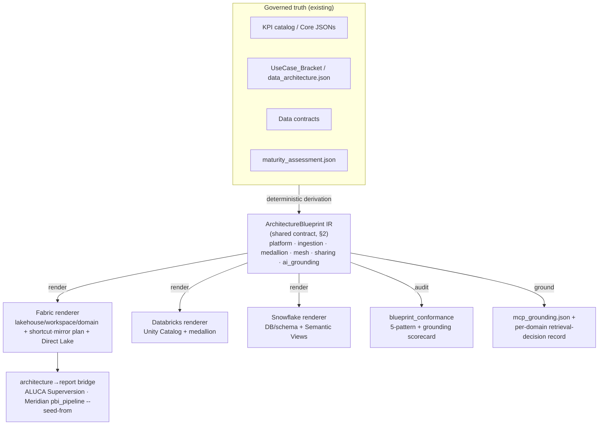

# Architecture Blueprint IR — Shared Contract Spec (draft)

> **Status:** Draft spec (no code). Sharpens the OneLake-AI-era plan:
> ALUCA `ADR-0015` and Freelancing `meridian/.../2026-07-15_onelake-ai-era-blueprint-alignment.md`.
>
> **MIRROR — field-identical across both repos (decision 2026-07-15).** This file is
> maintained **byte-identical** in two places, following the ADR-0005 contract-mirror
> discipline (as with Meridian-Core vendoring):
> - ALUCA: `docs/architecture/research/architecture-blueprint-ir-spec.md`
> - Freelancing: `meridian/docs/research/reporting-platform-blueprints/architecture-blueprint-ir-spec.md`
>
> The **`ArchitectureBlueprint` JSON Schema in §2 is the shared contract** and must not
> diverge between copies; a parity check (like ALUCA `canonical_contract` / Meridian
> `_canonical_mirror`) will enforce this once the layer is built. Everything else is
> explanatory. Build the schema once, mirror it, test parity — do not fork two IRs.

---

## 1. What this is

A governed, deterministic **Intermediate Representation of a data-platform architecture**,
one level *above* the semantic-model/report canonical model both repos already have
(ALUCA `CanonicalModel`, Meridian Core JSONs). Its fields **are** Microsoft's five
OneLake patterns plus the AI-era grounding surface. The same IR renders to multiple
stacks; only the renderer changes.



The three verbs (`render` / `audit` / `ground`) are the reusable standalone tool. The
five patterns are stack-neutral; the per-stack **native-feature mapping** differs (§4).

---

## 2. `ArchitectureBlueprint` JSON Schema (the shared contract)

```json
{
  "$schema": "https://json-schema.org/draft/2020-12/schema",
  "$id": "https://fhc/meridian/architecture-blueprint.schema.json",
  "title": "ArchitectureBlueprint",
  "type": "object",
  "required": [
    "schema_version",
    "platform",
    "medallion",
    "mesh",
    "ai_grounding"
  ],
  "additionalProperties": false,
  "properties": {
    "schema_version": {
      "type": "string",
      "const": "0.1.0"
    },
    "shared_workspace": {
      "type": "string",
      "description": "Name des geteilten Plattform-Workspace, sofern der Zuschnitt ihn wirklich erzeugt (Strategie 'single' oder 'central_prep_domain_consumption'). Wird er nicht materialisiert, fehlt das Feld — ein Name im IR, den es im Mandanten nicht gibt, waere schlimmer als keiner. Verbraucher: die Chargeback-Zuordnung, die wissen muss, welcher Workspace der geteilte ist, statt ihn zu erraten."
    },
    "platform": {
      "type": "object",
      "description": "P4 Platform Simplification — one platform owns each workload class.",
      "required": [
        "stack",
        "ownership_boundaries"
      ],
      "additionalProperties": false,
      "properties": {
        "stack": {
          "enum": [
            "fabric",
            "databricks",
            "snowflake",
            "eu_sovereign",
            "air_gap"
          ]
        },
        "blueprint_ref": {
          "type": "integer",
          "minimum": 1,
          "maximum": 4,
          "description": "Meridian reporting-platform-blueprint 1–4 (00_index.md); null for ALUCA."
        },
        "capacity": {
          "type": "string",
          "description": "Name of the assigned Fabric capacity (CLI: --capacity). Absent = not named; consumers must not invent one. A capacity groups workspaces ACROSS domains and is the unit throttling and cost attach to, which is why it belongs in the blueprint and not only in the emitted scripts. The `<CAPACITY_NAME>` placeholder is deliberately not stored here: a blueprint field holding a placeholder looks like a statement and is none."
        },
        "capacity_sku": {
          "type": "string",
          "description": "Assigned Fabric capacity SKU (e.g. F64). Absent = not assigned; consumers must then state a recommended FLOOR instead of assuming one (Direct-Lake guardrails). The floor is computed by tooling/superversion/capacity.py from platform.sizing."
        },
        "sizing": {
          "type": "object",
          "additionalProperties": false,
          "description": "Inputs for the capacity floor and procurement recommendation (tooling/superversion/capacity.py). Every field is optional and every absent field is reported as an unknown rather than defaulted: a floor derived from half the inputs looks as authoritative as a complete one. Sizing and procurement are separate axes — sizing asks which SKU is technically sufficient, procurement asks how to buy it.",
          "properties": {
            "largest_model_gb": {
              "type": "number",
              "minimum": 0,
              "description": "Size of the biggest semantic model in GB. Drives the memory-per-model floor. F2 through F8 all cap at 3 GB; the first jump is F16 (5 GB), so moving F4 to F8 buys no model-size headroom at all."
            },
            "largest_table_rows_millions": {
              "type": "number",
              "minimum": 0,
              "description": "Rows in the biggest fact table, in millions. Drives the Direct-Lake guardrail floor. Exceeding it does not fail the model, it falls back to DirectQuery — which is why it belongs in the plan rather than in an incident."
            },
            "viewers": {
              "type": "integer",
              "minimum": 0,
              "description": "People consuming reports. Below F64 every viewer needs a Power BI Pro licence, which makes F64 a licensing threshold rather than a performance one. The break-even viewer count is computed from current prices, not assumed."
            },
            "operating_hours_per_week": {
              "type": "number",
              "minimum": 0,
              "maximum": 168,
              "description": "Hours per week the capacity must be available. The only input deciding reservation vs pay-as-you-go, because a capacity is billed by provisioned size and an idle capacity costs the same as a busy one. Break-even is 100 h/week (59.5 % runtime)."
            },
            "chargeback_per_use_case": {
              "type": "boolean",
              "description": "Whether capacity cost is charged back per use case or business unit. Decides one capacity or several: the Azure invoice breaks down per capacity resource only, and Fabric workspaces are not ARM resources and cannot carry tags."
            },
            "region": {
              "type": "string",
              "description": "Target Azure region for the capacity, e.g. westeurope. Determines where compute and OneLake data reside; changing it later requires a new capacity and workspace reassignment. European base rates differ by up to 13.6 %, the reservation discount does not."
            }
          }
        },
        "tier": {
          "enum": [
            "standard",
            "enterprise",
            "business_critical",
            "vps",
            "premium"
          ],
          "description": "Edition/plan tier of the target platform — the axis capacity_sku does NOT cover on non-Fabric stacks. Snowflake: standard | enterprise | business_critical | vps (docs.snowflake.com/en/user-guide/intro-editions). Databricks: standard (EOL on AWS 2025-10-01, auto-upgraded to premium) | premium | enterprise; Azure premium corresponds to AWS/GCP enterprise. Absent = unknown, and consumers must NOT assume a tier: replication/failover, PrivateLink, extended Time Travel and predictive optimization each require a specific tier, so an assumed tier produces runbooks the customer cannot execute."
        },
        "ownership_boundaries": {
          "type": "array",
          "items": {
            "type": "object",
            "required": [
              "workload_class",
              "owner_platform"
            ],
            "additionalProperties": false,
            "properties": {
              "workload_class": {
                "enum": [
                  "ingestion",
                  "transformation",
                  "serving",
                  "ml"
                ]
              },
              "owner_platform": {
                "type": "string"
              }
            }
          }
        },
        "capacities": {
          "type": "array",
          "description": "Die Kapazitaeten dieser Lieferung. **Mehrzahl, weil eine Lieferung mehrere hat.** Bis zum 26.08.2026 fuehrte das Schema genau ein `platform.capacity` fuer alles; eine gemessene Kundenlieferung laeuft auf zweien (je eine Kapazitaet pro Domaene), und das war damit nicht ausdrueckbar. Das ist kein Darstellungsproblem: die Zuweisung eines Workspace zu seiner Kapazitaet ist ein Provisionierungsschritt. `platform.capacity` bleibt als Kurzform fuer den Einzelfall bestehen und wird beim Ableiten hierher normalisiert; Verbraucher lesen `capacities`.",
          "items": {
            "type": "object",
            "additionalProperties": false,
            "anyOf": [
              {
                "required": [
                  "name"
                ]
              },
              {
                "required": [
                  "zielbild",
                  "entscheidung"
                ]
              }
            ],
            "description": "Eine Kapazitaet. Entweder benannt (`name`) oder als Zielbild markiert — ein Eintrag, der weder das eine noch das andere ist, waere eine Behauptung ohne Herkunft.",
            "properties": {
              "name": {
                "type": "string",
                "description": "Technischer Name der Kapazitaet, wie er im Fabric-Adminportal steht."
              },
              "sku": {
                "type": "string",
                "description": "Zugewiesene SKU, etwa `F64`."
              },
              "region": {
                "type": "string",
                "description": "Region der Kapazitaet. Sie entscheidet ueber Datenresidenz und ist deshalb eine Architekturaussage, keine Betriebsnotiz."
              },
              "domain": {
                "type": "string",
                "description": "Name der Domaene, die auf dieser Kapazitaet laeuft. Fehlt er, traegt die Kapazitaet alle Domaenen — der Einzelkapazitaetsfall."
              },
              "purpose": {
                "type": "string"
              },
              "zielbild": {
                "type": "boolean",
                "description": "Dieser Eintrag ist ein Zielbild, keine Festlegung: er entsteht aus einer Vorlage oder Konvention, nicht aus einer Aussage des Kunden. Verbraucher muessen ihn sichtbar als noch nicht entschieden kennzeichnen (D-340). Ein Zielbild ohne `entscheidung` ist Raten mit Schraffur und deshalb unzulaessig."
              },
              "entscheidung": {
                "type": "string",
                "description": "Was zu entscheiden ist und woher die Antwort kommt. Pflicht, sobald `zielbild` gesetzt ist."
              }
            }
          }
        },
        "tenant": {
          "type": "object",
          "additionalProperties": false,
          "description": "Der Mandant. Er ist die aeusserste Klammer und die Stelle, an der die zentrale Zustaendigkeit sitzt (Mandanteneinstellungen, Kapazitaetsverwaltung, Entra ID, Netz, Gateway). Ohne ihn beginnt das Bild bei der Domaene und laesst offen, wer die Leitplanken setzt.",
          "properties": {
            "name": {
              "type": "string"
            },
            "central_responsibility": {
              "type": "string",
              "description": "Wer die Leitplanken haelt — als Satz, nicht als Personenname."
            },
            "zielbild": {
              "type": "boolean",
              "description": "Dieser Eintrag ist ein Zielbild, keine Festlegung: er entsteht aus einer Vorlage oder Konvention, nicht aus einer Aussage des Kunden. Verbraucher muessen ihn sichtbar als noch nicht entschieden kennzeichnen (D-340). Ein Zielbild ohne `entscheidung` ist Raten mit Schraffur und deshalb unzulaessig."
            },
            "entscheidung": {
              "type": "string",
              "description": "Was zu entscheiden ist und woher die Antwort kommt. Pflicht, sobald `zielbild` gesetzt ist."
            }
          }
        },
        "gateways": {
          "type": "array",
          "description": "Datengateways. Ein Gateway steht **im Datenfluss** zwischen einer lokalen Quelle und Bronze und ist damit ein Baustein wie ein Lakehouse, kein Betriebsdetail: faellt es aus, steht die Anbindung. Es hat einen eigenen Betreiber, eigene Portanforderungen und eine eigene Dienstidentitaet.",
          "items": {
            "type": "object",
            "additionalProperties": false,
            "anyOf": [
              {
                "required": [
                  "name"
                ]
              },
              {
                "required": [
                  "zielbild",
                  "entscheidung"
                ]
              }
            ],
            "properties": {
              "name": {
                "type": "string"
              },
              "kind": {
                "enum": [
                  "on_premises",
                  "vnet"
                ],
                "description": "On-premises-Datengateway oder VNet-Datengateway. Die beiden loesen verschiedene Probleme und haben verschiedene Betreiber."
              },
              "owner": {
                "type": "string"
              },
              "service_identity": {
                "type": "string"
              },
              "requirements": {
                "type": "array",
                "items": {
                  "type": "string"
                },
                "description": "Ports, Erreichbarkeit, Wartung."
              },
              "domain": {
                "type": "string",
                "description": "Domaene, deren Quellen ueber dieses Gateway laufen. Fehlt sie, gilt es fuer alle."
              },
              "zielbild": {
                "type": "boolean",
                "description": "Dieser Eintrag ist ein Zielbild, keine Festlegung: er entsteht aus einer Vorlage oder Konvention, nicht aus einer Aussage des Kunden. Verbraucher muessen ihn sichtbar als noch nicht entschieden kennzeichnen (D-340). Ein Zielbild ohne `entscheidung` ist Raten mit Schraffur und deshalb unzulaessig."
              },
              "entscheidung": {
                "type": "string",
                "description": "Was zu entscheiden ist und woher die Antwort kommt. Pflicht, sobald `zielbild` gesetzt ist."
              }
            }
          }
        }
      }
    },
    "ingestion": {
      "type": "array",
      "description": "P1 Data Access Unification — virtualize, don't duplicate.",
      "items": {
        "type": "object",
        "required": [
          "source",
          "access_mode",
          "rationale"
        ],
        "additionalProperties": false,
        "properties": {
          "source": {
            "type": "string"
          },
          "source_system": {
            "type": "string"
          },
          "domain": {
            "type": "string",
            "description": "Owning domain (its name). Carried explicitly so emitters read the owner instead of re-deriving it from a '<domain-slug>_' name prefix — that heuristic silently dropped every source not following the convention (no transform, no copy activity, no warning)."
          },
          "access_mode": {
            "enum": [
              "shortcut",
              "shortcut_transform",
              "mirror",
              "copy"
            ],
            "description": "How the source is made available. `shortcut_transform` = a OneLake shortcut with file transformations (CSV/Parquet/JSON/Excel -> Delta, polled ~2 min): it replaces an ingestion pipeline, but its TARGET TABLE IS READ-OPTIMIZED and supports neither MERGE nor DELETE — so a layer landed this way cannot be the target of an upsert."
          },
          "rationale": {
            "type": "string",
            "description": "Why this mode. copy requires perf/isolation/compliance justification."
          },
          "handover_layer": {
            "enum": [
              "raw",
              "conformed",
              "semantic",
              "semantic-zerocopy"
            ],
            "description": "SAP-to-Fabric handover layer: from which layer the source hands off (raw source tables / conformed data product / semantic model / bidirectional zero-copy)."
          },
          "connector": {
            "enum": [
              "odbc-live",
              "odbc-copy",
              "hana",
              "odata",
              "premium-outbound-shortcut",
              "mirroring",
              "sap-cdc",
              "open-mirroring",
              "bdc-connect"
            ],
            "description": "Physical handover connector; must be compatible with handover_layer and access_mode (sap_handover_gate)."
          },
          "sensitivity": {
            "enum": [
              "public",
              "internal",
              "confidential",
              "restricted"
            ]
          },
          "access_mode_assumed": {
            "type": "boolean",
            "description": "True when the access mode could NOT be derived from the source type and fell back to `copy` (a pipeline can read anything, so it is never impossible — but it is not always the cheapest choice). A declaration instead of a prose marker: the conformance gate used to detect the fallback by sniffing whether the rationale began with the word 'default', which broke the moment the rationale was reworded."
          },
          "schemas": {
            "type": "array",
            "items": {
              "type": "string",
              "minLength": 1
            },
            "uniqueItems": true,
            "description": "Optional allowlist of physical source schemas for metadata introspection and ingestion planning."
          },
          "tables": {
            "type": "array",
            "items": {
              "type": "string",
              "minLength": 1
            },
            "uniqueItems": true,
            "description": "Optional allowlist of unqualified physical source table names. When present, source introspection must not discover other tables."
          }
        }
      }
    },
    "medallion": {
      "type": "object",
      "description": "P2 Medallion — bronze is an immutable system of record; no layer-skipping.",
      "required": [
        "bronze",
        "silver",
        "gold",
        "no_layer_skip"
      ],
      "additionalProperties": false,
      "properties": {
        "bronze": {
          "type": "object",
          "required": [
            "enabled",
            "immutable",
            "append_only"
          ],
          "additionalProperties": false,
          "properties": {
            "enabled": {
              "type": "boolean"
            },
            "outsourced": {
              "type": "boolean",
              "description": "true = a project/customer owns bronze upstream; still specified, not unscoped."
            },
            "immutable": {
              "const": true
            },
            "append_only": {
              "const": true
            },
            "format": {
              "enum": [
                "source",
                "parquet",
                "delta"
              ],
              "default": "source"
            }
          }
        },
        "silver": {
          "type": "object",
          "required": [
            "data_contract_ref"
          ],
          "additionalProperties": false,
          "properties": {
            "data_contract_ref": {
              "type": "string"
            },
            "quality_threshold": {
              "type": "number",
              "minimum": 0,
              "maximum": 1
            }
          }
        },
        "gold": {
          "type": "object",
          "required": [
            "data_products"
          ],
          "additionalProperties": false,
          "properties": {
            "data_products": {
              "type": "array",
              "items": {
                "type": "object",
                "required": [
                  "name",
                  "kind"
                ],
                "additionalProperties": false,
                "properties": {
                  "name": {
                    "type": "string",
                    "pattern": "^(dim|fact|agg)_[a-z0-9_]+$"
                  },
                  "kind": {
                    "enum": [
                      "dimension",
                      "fact",
                      "aggregate"
                    ]
                  },
                  "grain": {
                    "type": "string"
                  },
                  "observation": {
                    "type": "object",
                    "description": "Declares that this product's grain is ONE OBSERVATION PER TIMESTAMP per entity — the shape a Fabric IQ TimeSeries binding needs. Absent = batch/transaction grain (the default): a TimeSeries binding there would mis-declare the semantics, because a transaction row is not a repeated observation of the same identity.",
                    "required": [
                      "timestamp_column"
                    ],
                    "additionalProperties": false,
                    "properties": {
                      "timestamp_column": {
                        "type": "string",
                        "description": "The time axis. Must be a column of this product."
                      },
                      "source": {
                        "enum": [
                          "lakehouse",
                          "eventhouse"
                        ],
                        "default": "lakehouse",
                        "description": "TimeSeries does NOT require an eventhouse — MS documents it with sourceType LakehouseTable. Declare eventhouse only for genuine telemetry; its clusterUri/databaseName stay tenant-specific VERIFY."
                      }
                    }
                  },
                  "generated": {
                    "type": "object",
                    "description": "Ein Produkt, das KEINE Quelle hat, weil es keine haben kann -- eine Datumsdimension entsteht aus einem Bereich, nicht aus einer Tabelle. Ausdrueckliche Angabe statt Namensraterei: an `dim_datum` vs. `dim_date` vs. `d_kalender` laesst sich das nicht festmachen.",
                    "additionalProperties": false,
                    "required": [
                      "kind"
                    ],
                    "properties": {
                      "kind": {
                        "enum": [
                          "calendar"
                        ],
                        "description": "Art des Generators. `calendar` = ein Satz je Kalendertag."
                      },
                      "from": {
                        "type": "string",
                        "description": "ISO-Datum, erster Tag (Vorgabe 2020-01-01)."
                      },
                      "to": {
                        "type": "string",
                        "description": "ISO-Datum, letzter Tag (Vorgabe 2035-12-31)."
                      }
                    }
                  },
                  "domain": {
                    "type": "string",
                    "minLength": 1,
                    "description": "Owning domain name, copied from the containing governed input domain during derivation. Optional for backwards compatibility with pre-existing hand-authored IR, but deterministic derivation always emits it; consumers must not infer ownership from product names."
                  }
                }
              }
            }
          }
        },
        "platinum": {
          "type": "object",
          "description": "Meridian-only: the semantic-model/ontology layer above gold.",
          "additionalProperties": false,
          "properties": {
            "semantic_model_ref": {
              "type": "string"
            }
          }
        },
        "no_layer_skip": {
          "const": true,
          "description": "Shortcuts must not bypass bronze→silver→gold."
        }
      }
    },
    "mesh": {
      "type": "object",
      "description": "P3 Data Mesh + Governance — domain→workspace topology + data-product publishing.",
      "required": [
        "domains"
      ],
      "additionalProperties": false,
      "properties": {
        "domains": {
          "type": "array",
          "items": {
            "type": "object",
            "required": [
              "name",
              "workspaces",
              "publishing"
            ],
            "additionalProperties": false,
            "properties": {
              "name": {
                "type": "string"
              },
              "workspaces": {
                "type": "array",
                "items": {
                  "type": "object",
                  "required": [
                    "name",
                    "role"
                  ],
                  "additionalProperties": false,
                  "properties": {
                    "name": {
                      "type": "string"
                    },
                    "role": {
                      "enum": [
                        "bronze",
                        "silver",
                        "gold",
                        "reporting",
                        "mixed"
                      ]
                    },
                    "stage": {
                      "enum": [
                        "dev",
                        "test",
                        "prod"
                      ],
                      "description": "The lifecycle stage this workspace belongs to, set when governance.stages materialises more than one. A Fabric deployment pipeline moves content BETWEEN workspaces, so a stage is a workspace of its own — not a flag on a shared one."
                    }
                  }
                }
              },
              "data_products": {
                "type": "array",
                "items": {
                  "type": "string"
                }
              },
              "row_security": {
                "type": "object",
                "description": "The row-security cut of this domain: what separates who sees what. Declared here because it is an architecture fact — it decides which columns must survive into every protected gold table — and because OneLake security cannot derive it: its predicates are static T-SQL with no caller identity to read. Exactly one of two forms: a FLAT cut (column + values), one role per value; or a HIERARCHICAL cut (levels + grants), where every protected row carries its ancestors on each level so that one grant covers every descendant. Measured against a real 7-level org hierarchy: a single grant naming ONE node returned the rows of 59 descendant nodes (177 of 540), none of which appears in the predicate.",
                "additionalProperties": false,
                "properties": {
                  "column": {
                    "type": "string",
                    "description": "The cut column. It must exist PHYSICALLY in every protected table: OneLake security has no multi-table RLS and no relationship traversal, so a predicate on a dimension does not reach its facts."
                  },
                  "values": {
                    "type": "array",
                    "items": {
                      "type": "string"
                    },
                    "description": "One role and one Entra group per value. Fabric's documented limits bound this: 250 data-access roles per item, 500 members per role, predicate at most 1000 characters."
                  },
                  "protected_products": {
                    "type": "array",
                    "items": {
                      "type": "string"
                    },
                    "description": "The gold products the cut applies to. Absent or empty means every data_product of the domain. For a hierarchical cut these products must carry EVERY level column — that is a build obligation on silver-to-gold, not a modelling accident, and it must be checked: an RLS rule pointing at a missing column yields zero rows, which is indistinguishable from \"this person may see nothing\"."
                  },
                  "group_pattern": {
                    "type": "string",
                    "description": "Naming pattern for the Entra group. Placeholders: {value} for a flat cut, {level} and {node} for a hierarchical one. The group is NAMED, never created — creating groups is a tenant act with an owner outside this delivery. Membership belongs on the GROUP, never on a person: measured, a person added to a group keeps the old access until a token carrying the new group claim is issued."
                  },
                  "levels": {
                    "type": "array",
                    "minItems": 1,
                    "description": "The hierarchy levels, coarsest first. Each names an ancestor column that must exist PHYSICALLY on every protected table — the ancestor value denormalised onto the row. That denormalisation is what makes \"everything below node X\" a static equality: OneLake RLS has no JOIN, no subquery, no caller identity and a 1000-character limit, so an enumerated descendant list fails on all four counts. The columns are a CONTRACT: a rule naming a column that does not exist shows NO rows rather than an error.",
                    "items": {
                      "type": "object",
                      "required": [
                        "name",
                        "column"
                      ],
                      "additionalProperties": false,
                      "properties": {
                        "name": {
                          "type": "string",
                          "description": "Level name, referenced by grants[].level."
                        },
                        "column": {
                          "type": "string",
                          "description": "The ancestor column on the protected tables."
                        },
                        "type": {
                          "type": "string",
                          "enum": [
                            "string",
                            "int"
                          ],
                          "default": "string",
                          "description": "Defaults to string, and that default is deliberate. Measured on real data: the finest level carried leading zeros (0150, 0908, 0000). Typing it as an integer turns 0150 into 150 and breaks the join silently — no error, just missing rows. Only declare int when every value is provably numeric."
                        }
                      }
                    }
                  },
                  "grants": {
                    "type": "array",
                    "minItems": 1,
                    "description": "One OneLake role and one Entra group per grant — per RESPONSIBILITY CUT, not per node of the hierarchy. A hierarchy with 180 nodes needs as many grants as there are distinct scopes people are assigned to. Fabric bounds this: 250 data-access roles per item, 500 members per role.",
                    "items": {
                      "type": "object",
                      "required": [
                        "level",
                        "node"
                      ],
                      "additionalProperties": false,
                      "properties": {
                        "level": {
                          "type": "string",
                          "description": "Which level the node sits on. REQUIRED, and not derivable. Measured on real data: the code 19 is \"Europe I\" at branch level AND \"Austria\" at sub-branch level. A grant without a level is ambiguous and would silently cut the wrong subtree."
                        },
                        "node": {
                          "type": [
                            "string",
                            "number"
                          ],
                          "description": "The node value, compared with = against the level column."
                        },
                        "label": {
                          "type": "string",
                          "description": "Human-readable name of the scope, for the role description and the run sheet."
                        }
                      }
                    }
                  }
                },
                "oneOf": [
                  {
                    "required": [
                      "column",
                      "values"
                    ],
                    "not": {
                      "anyOf": [
                        {
                          "required": [
                            "levels"
                          ]
                        },
                        {
                          "required": [
                            "grants"
                          ]
                        }
                      ]
                    }
                  },
                  {
                    "required": [
                      "levels",
                      "grants"
                    ],
                    "not": {
                      "anyOf": [
                        {
                          "required": [
                            "column"
                          ]
                        },
                        {
                          "required": [
                            "values"
                          ]
                        }
                      ]
                    }
                  }
                ]
              },
              "publishing": {
                "type": "object",
                "required": [
                  "endorsement",
                  "intended_audience"
                ],
                "additionalProperties": false,
                "properties": {
                  "catalog": {
                    "type": "boolean",
                    "description": "Registered in OneLake Catalog."
                  },
                  "purview_data_product": {
                    "type": "boolean"
                  },
                  "endorsement": {
                    "enum": [
                      "none",
                      "promoted",
                      "certified"
                    ]
                  },
                  "metadata": {
                    "type": "object",
                    "additionalProperties": false,
                    "properties": {
                      "owner": {
                        "type": "string"
                      },
                      "description": {
                        "type": "string"
                      },
                      "tags": {
                        "type": "array",
                        "items": {
                          "type": "string"
                        }
                      }
                    }
                  },
                  "intended_audience": {
                    "enum": [
                      "internal",
                      "partner",
                      "public"
                    ]
                  }
                }
              },
              "data_contract_ref": {
                "type": "string",
                "description": "The silver data contract of THIS domain. Without it the emitters fall back to the single global `medallion.silver.data_contract_ref` — with several source packs in one run that made every generated SQL file cite the FIRST pack's contract, so the finance tables pointed at the order-to-cash contract. A wrong reference in a delivered artifact is worse than none: it sends someone confidently to the wrong place."
              }
            }
          }
        }
      }
    },
    "sharing": {
      "type": "array",
      "description": "P5 External Data Sharing — sanitized, labeled, separate workspace.",
      "items": {
        "type": "object",
        "required": [
          "external_product",
          "source_gold_ref",
          "label",
          "workspace"
        ],
        "additionalProperties": false,
        "properties": {
          "external_product": {
            "type": "string"
          },
          "source_gold_ref": {
            "type": "string"
          },
          "sanitization": {
            "type": "array",
            "items": {
              "type": "string"
            },
            "description": "Masked/removed/reduced fields."
          },
          "label": {
            "enum": [
              "public",
              "external_use"
            ]
          },
          "workspace": {
            "type": "string"
          }
        }
      }
    },
    "ai_grounding": {
      "type": "object",
      "description": "AI-era — agents ground on gold/silver, never bronze; retrieval-first then MCP.",
      "required": [
        "grounding_surface",
        "retrieval"
      ],
      "additionalProperties": false,
      "properties": {
        "grounding_surface": {
          "type": "array",
          "items": {
            "enum": [
              "gold",
              "silver"
            ]
          },
          "description": "Bronze is intentionally not allowed here."
        },
        "retrieval": {
          "type": "array",
          "items": {
            "type": "object",
            "required": [
              "domain",
              "strategy"
            ],
            "additionalProperties": false,
            "properties": {
              "domain": {
                "type": "string"
              },
              "strategy": {
                "enum": [
                  "builtin",
                  "mcp",
                  "both"
                ],
                "description": "builtin (Fabric IQ/Foundry IQ/indexer) first; mcp only for live/action."
              },
              "certified_sources": {
                "type": "array",
                "items": {
                  "type": "string"
                }
              },
              "auth_required": {
                "type": "boolean"
              }
            }
          }
        },
        "emits": {
          "type": "array",
          "items": {
            "type": "string"
          },
          "default": [
            "mcp_grounding.json"
          ]
        },
        "adaptive_gold": {
          "type": "object",
          "description": "Forward-looking: AI materializes hot gold datasets from telemetry (ALUCA ADR-0009 Wirkungs-Loop seed).",
          "additionalProperties": false,
          "properties": {
            "enabled": {
              "type": "boolean"
            },
            "source": {
              "enum": [
                "fabric_telemetry",
                "powerbi_telemetry",
                "wirkungs_loop"
              ]
            }
          }
        },
        "data_agent": {
          "type": "object",
          "description": "Fabric Data Agent as an architectural fact — it pulls tenant switches (Copilot + cross-geo), capacity and residency consequences behind it, so it belongs in the IR rather than in a render flag.",
          "additionalProperties": false,
          "properties": {
            "enabled": {
              "type": "boolean"
            },
            "name": {
              "type": "string"
            }
          }
        },
        "ontology": {
          "type": "object",
          "description": "Fabric IQ Ontology as an architectural fact — the layer that unifies meaning across sources and grounds agents; needs its own tenant switch.",
          "additionalProperties": false,
          "properties": {
            "enabled": {
              "type": "boolean"
            },
            "name": {
              "type": "string"
            }
          }
        }
      }
    },
    "governance": {
      "type": "object",
      "additionalProperties": false,
      "required": [
        "ownership_model",
        "workspace_strategy",
        "rationale",
        "source",
        "derived_from_governance"
      ],
      "description": "The governance determination result, machine-readable — and the thing it steers: the workspace layout and the permission strategy. Until 31.07.2026 the workshop recommendation reached the build-seed concepts but never the IR, so a data-mesh customer and an enterprise-BI customer got the identical workspace cut.",
      "properties": {
        "profile": {
          "type": [
            "string",
            "null"
          ],
          "description": "Operating model from the governance workshop (dama / datamesh / dgi)."
        },
        "ist_state": {
          "type": [
            "string",
            "null"
          ],
          "description": "Maturity state from the workshop (greenfield / foundation / decision_rights / federated)."
        },
        "ownership_model": {
          "enum": [
            "enterprise_bi",
            "managed_self_service",
            "business_led_self_service"
          ],
          "description": "Microsoft's own content-ownership taxonomy (Fabric adoption roadmap)."
        },
        "workspace_strategy": {
          "enum": [
            "per_domain",
            "central_prep_domain_consumption",
            "single",
            "per_layer"
          ],
          "description": "How mesh.domains[].workspaces are cut. Read by derive_blueprint. 'per_layer' gives each medallion layer its own workspace, which is Microsoft's own recommendation for the medallion deployment model ('we recommend that you create each lakehouse in its own, separate workspace') and the only cut that makes the raw layer invisible to business users through workspace membership alone."
        },
        "workspace_prefix": {
          "type": "string",
          "description": "Prefix for derived workspace names; 'ws-' when unset. Customers arrive with a house convention, and until 11.08.2026 the prefix was hardcoded — so every generated name had to be renamed by hand afterwards, at which point it no longer matched the apply plan that referenced it."
        },
        "workspace_layers": {
          "type": "array",
          "items": {
            "enum": [
              "bronze",
              "silver",
              "gold",
              "reporting"
            ]
          },
          "description": "Which layers get their own workspace under workspace_strategy 'per_layer'; all four when unset. Shortening the list is how a delivery whose raw layer disappears — sources replaced by logic inside Fabric — stays expressible without touching this schema."
        },
        "workspace_layer_names": {
          "type": "object",
          "additionalProperties": {
            "type": "string"
          },
          "description": "Overrides the name segment a layer contributes to its workspace name (e.g. reporting -> 'report'). The role stays canonical so every downstream emitter keeps working; only the name changes. Without this, reproducing a customer's existing convention meant renaming after generation — and a renamed workspace no longer matches the apply plan that was meant to create it."
        },
        "workspace_layer_labels": {
          "type": "object",
          "additionalProperties": {
            "type": "string"
          },
          "description": "Overrides the human-readable name of a layer in generated documentation (e.g. reporting -> 'Consumption'). Distinct from workspace_layer_names, which changes the name segment inside a workspace name; this changes only the word the handbook uses. Without it the label was derived as role.title(), which is a convention the blueprint does not actually hold: the customer's approved handbook says 'Consumption' throughout while the blueprint claimed 'Reporting', and the twin comparison reported a contradiction that no customer decision could resolve."
        },
        "stages": {
          "type": "array",
          "items": {
            "enum": [
              "dev",
              "test",
              "prod"
            ]
          },
          "description": "Lifecycle stages materialised as separate workspaces. Absent means one unstaged set. Named here rather than at the emit boundary because a deployment pipeline moves content between workspaces: the stage decides how many workspaces exist, which is an architecture fact, not a rendering option."
        },
        "rationale": {
          "type": "string",
          "description": "Why this cut — with its grounding."
        },
        "source": {
          "type": "string",
          "description": "Where the decision came from (workshop profile, or 'no governance result')."
        },
        "derived_from_governance": {
          "type": "boolean",
          "description": "False means the cut is the old convention, not a derivation. Stated rather than silently defaulted."
        },
        "ist_override": {
          "type": "string",
          "description": "Set when the maturity state changed the cut."
        },
        "grounding": {
          "type": "array",
          "items": {
            "type": "string"
          },
          "description": "The Microsoft documentation the mapping rests on."
        },
        "concepts": {
          "type": "array",
          "items": {
            "type": "string"
          },
          "description": "Build-seed concepts from governance_bridge (odcs-contract-first, …)."
        },
        "principals": {
          "type": "array",
          "description": "Die Gruppen, an denen Rechte haengen. **Gruppen, nicht Personen** — ein Bauplan, der Personennamen fuehrt, ist am Tag nach der ersten Versetzung falsch. Jeder Eintrag traegt neben Zweck und Eigentuemer auch `prohibited`: was diese Gruppe ausdruecklich *nicht* darf. Das Verbot ist die haerteste Aussage einer Rollendefinition und die einzige, die eine Fehlvergabe erkennbar macht.",
          "items": {
            "type": "object",
            "additionalProperties": false,
            "anyOf": [
              {
                "required": [
                  "technical_name"
                ]
              },
              {
                "required": [
                  "zielbild",
                  "entscheidung"
                ]
              }
            ],
            "properties": {
              "technical_name": {
                "type": "string",
                "description": "Der Name der Gruppe im Verzeichnis, etwa `sg-fabric-infra-contributor`."
              },
              "display_name": {
                "type": "string"
              },
              "kind": {
                "enum": [
                  "security_group",
                  "consumer_group",
                  "rls_group",
                  "service_principal"
                ]
              },
              "purpose": {
                "type": "string"
              },
              "owner": {
                "type": "string"
              },
              "prohibited": {
                "type": "string",
                "description": "Was diese Gruppe ausdruecklich nicht darf."
              },
              "domain": {
                "type": "string"
              },
              "zielbild": {
                "type": "boolean",
                "description": "Dieser Eintrag ist ein Zielbild, keine Festlegung: er entsteht aus einer Vorlage oder Konvention, nicht aus einer Aussage des Kunden. Verbraucher muessen ihn sichtbar als noch nicht entschieden kennzeichnen (D-340). Ein Zielbild ohne `entscheidung` ist Raten mit Schraffur und deshalb unzulaessig."
              },
              "entscheidung": {
                "type": "string",
                "description": "Was zu entscheiden ist und woher die Antwort kommt. Pflicht, sobald `zielbild` gesetzt ist."
              }
            }
          }
        },
        "permission_templates": {
          "type": "object",
          "description": "Wer auf welchem Workspace welche Rolle bekommt — als Vorlage mit Platzhaltern (`{unit}`), nicht je Workspace ausgeschrieben. Eine ausgeschriebene Matrix ist nach dem naechsten Workspace falsch; eine Vorlage bleibt richtig.",
          "additionalProperties": {
            "type": "array",
            "items": {
              "type": "object",
              "additionalProperties": false,
              "required": [
                "principal",
                "role",
                "targets"
              ],
              "properties": {
                "principal": {
                  "type": "string",
                  "description": "Gruppenname oder Vorlage mit `{unit}`."
                },
                "role": {
                  "type": "string",
                  "description": "Workspace-Rolle (Admin, Member, Contributor, Viewer) oder eine feinere Zuweisung wie `Read + OneLake role`."
                },
                "targets": {
                  "type": "string"
                },
                "purpose": {
                  "type": "string"
                },
                "bypasses_rls": {
                  "type": "boolean",
                  "description": "Ob diese Zuweisung die Zeilensicherheit umgeht. Die wichtigste Einzelaussage der ganzen Matrix — wer sie umgeht, sieht alles."
                }
              }
            }
          }
        },
        "security": {
          "type": "object",
          "additionalProperties": false,
          "description": "Wie fein die Sicherheit schneidet. Bis zum 26.08.2026 gab es dafuer ein einziges Feld `sensitivity` an der Quelle — das beantwortet die Frage, wie schutzbeduerftig etwas ist, aber nicht, wie der Schutz greift.",
          "properties": {
            "ols": {
              "type": "string",
              "description": "Objektsicherheit: welche Objekte."
            },
            "cls": {
              "type": "string",
              "description": "Spaltensicherheit: welche Spalten."
            },
            "semantic_rls": {
              "type": "string",
              "description": "Zeilensicherheit im Semantikmodell."
            },
            "onelake_baseline": {
              "type": "string",
              "description": "Die Grundregel auf OneLake, gegen die jede Rolle gemessen wird."
            },
            "limitations": {
              "type": "array",
              "items": {
                "type": "string"
              },
              "description": "Was dieser Schnitt ausdruecklich nicht leistet. Eine Sicherheitsangabe ohne ihre Grenzen liest sich als Zusage."
            },
            "zielbild": {
              "type": "boolean",
              "description": "Dieser Eintrag ist ein Zielbild, keine Festlegung: er entsteht aus einer Vorlage oder Konvention, nicht aus einer Aussage des Kunden. Verbraucher muessen ihn sichtbar als noch nicht entschieden kennzeichnen (D-340). Ein Zielbild ohne `entscheidung` ist Raten mit Schraffur und deshalb unzulaessig."
            },
            "entscheidung": {
              "type": "string",
              "description": "Was zu entscheiden ist und woher die Antwort kommt. Pflicht, sobald `zielbild` gesetzt ist."
            }
          }
        },
        "decisions": {
          "type": "array",
          "description": "Architekturentscheidungen mit ihren Alternativen. **Die Alternative gehoert dazu**: eine Empfehlung ohne die verworfene Option ist im naechsten Gespraech nicht verteidigbar, und der Kunde kann nicht pruefen, ob seine Lage bedacht wurde.",
          "items": {
            "type": "object",
            "additionalProperties": false,
            "required": [
              "title",
              "recommendation"
            ],
            "properties": {
              "title": {
                "type": "string"
              },
              "recommendation": {
                "type": "string"
              },
              "alternatives": {
                "type": "string"
              },
              "topic": {
                "type": "string",
                "description": "Woran die Entscheidung haengt (etwa `ingestion`, `serving`, `cicd`) — damit sie am richtigen Baustein erscheinen kann."
              },
              "zielbild": {
                "type": "boolean",
                "description": "Dieser Eintrag ist ein Zielbild, keine Festlegung: er entsteht aus einer Vorlage oder Konvention, nicht aus einer Aussage des Kunden. Verbraucher muessen ihn sichtbar als noch nicht entschieden kennzeichnen (D-340). Ein Zielbild ohne `entscheidung` ist Raten mit Schraffur und deshalb unzulaessig."
              },
              "entscheidung": {
                "type": "string",
                "description": "Was zu entscheiden ist und woher die Antwort kommt. Pflicht, sobald `zielbild` gesetzt ist."
              }
            }
          }
        },
        "artefact_templates": {
          "type": "object",
          "description": "Welche Artefakte je Schicht entstehen und **wer jedes besitzt, baut und betreibt**. Die drei Rollen stehen hier und nicht im Handbuch daneben, weil ein Artefakt ohne Zustaendigkeit im Bild ein Kaestchen ist: es sagt, dass etwas existiert, und nicht, wen man ruft, wenn es steht. `technical_name` traegt die Platzhalter (`{unit}`, `{env_suffix}`, `{source_1}`), die `domain_template_values` fuellt.",
          "additionalProperties": {
            "type": "object",
            "additionalProperties": false,
            "anyOf": [
              {
                "required": [
                  "type"
                ]
              },
              {
                "required": [
                  "zielbild",
                  "entscheidung"
                ]
              }
            ],
            "properties": {
              "type": {
                "type": "string",
                "description": "Die Artefaktart, etwa `pipeline`, `lakehouse`, `notebook`, `semantic_model`, `report`, `variable_library`, `workspace_app`."
              },
              "layer": {
                "type": "string",
                "description": "Die Schicht, in der das Artefakt liegt (`bronze`, `silver`, `gold`, `reporting`)."
              },
              "technical_name": {
                "type": "string"
              },
              "owner": {
                "type": "string",
                "description": "Wem es gehoert — die fachliche Rolle."
              },
              "builder": {
                "type": "string",
                "description": "Wer es baut und aendert — in der Regel eine Gruppe."
              },
              "runner": {
                "type": "string",
                "description": "Unter welcher Identitaet es laeuft — in der Regel ein Dienstkonto. Getrennt vom Erbauer, weil ein Lauf unter einem persoenlichen Konto beim naechsten Austritt stehen bleibt."
              },
              "details": {
                "type": "string"
              },
              "activities": {
                "type": "array",
                "items": {
                  "type": "string"
                },
                "description": "Die Schritte innerhalb des Artefakts, sofern es welche hat (Pipeline-Aktivitaeten)."
              },
              "zielbild": {
                "type": "boolean",
                "description": "Dieser Eintrag ist ein Zielbild, keine Festlegung: er entsteht aus einer Vorlage oder Konvention, nicht aus einer Aussage des Kunden. Verbraucher muessen ihn sichtbar als noch nicht entschieden kennzeichnen (D-340). Ein Zielbild ohne `entscheidung` ist Raten mit Schraffur und deshalb unzulaessig."
              },
              "entscheidung": {
                "type": "string",
                "description": "Was zu entscheiden ist und woran die Antwort abgelesen wird."
              }
            }
          }
        },
        "domain_template_values": {
          "type": "object",
          "description": "Womit die Platzhalter der Artefaktnamen je Domaene gefuellt werden (`source_1`, `product_1`, `security_product`). Ausdruecklich **nicht** ableitbar: gemessen am Kundenmodell fuellt das Handbuch `product_1` mit dem Anwendungsfall und nicht mit dem alphabetisch ersten Gold-Produkt. Eine Sortierung, die sich als Aussage ausgibt, ist Raten.",
          "additionalProperties": {
            "type": "object",
            "additionalProperties": {
              "type": "string"
            }
          }
        },
        "technical_columns": {
          "type": "array",
          "description": "Die Audit-Spalten, die **jede** Bronze-Tabelle traegt: Herkunftssystem, Herkunftstabelle, Quellsatz-ID, Quellaenderungszeit, Ladezeit, Lauf-ID. Sie sind Architektur und keine Konvention — ohne sie ist keine Abstammung nachweisbar und kein Wiederanlauf pruefbar.",
          "items": {
            "type": "string"
          }
        },
        "security_columns": {
          "type": "array",
          "description": "Die Organisationsspalten, die in **jeder** geschuetzten Gold-Tabelle physisch stehen muessen. Sie folgen normalerweise aus `mesh.domains[].row_security` und stehen nur dann hier, wenn der Schnitt sie nicht vollstaendig nennt. OneLake-RLS kennt nur einspaltige Praedikate (MS Learn, *Row-level security syntax reference*) — deshalb entscheidet diese Liste ueber die Tabellenform und nicht ueber eine Berechtigung.",
          "items": {
            "type": "string"
          }
        },
        "proposed_stages": {
          "type": "array",
          "description": "Strecken, die vorgeschlagen und noch nicht entschieden sind. Sie stehen **nicht** in `stages`, weil dort steht, was gebaut wird — eine vorgeschlagene Strecke wuerde dort Workspaces erzeugen, die niemand bestellt hat. Sie fehlen aber auch nicht: gemessen am Kundenmodell fuehrt das Handbuch TEST als „proposed DEV, TEST and PROD path (K-44 / O-57); customer decision pending\", und ohne diese Stelle meldete der Abgleich das als Drift statt als offene Entscheidung (D-341).",
          "items": {
            "type": "object",
            "additionalProperties": false,
            "required": [
              "name",
              "zielbild",
              "entscheidung"
            ],
            "properties": {
              "name": {
                "type": "string",
                "description": "Die Strecke, etwa `test`."
              },
              "zielbild": {
                "type": "boolean",
                "description": "Immer wahr: ein Eintrag hier ist per Bauart ein Zielbild (D-340)."
              },
              "entscheidung": {
                "type": "string",
                "description": "Was zu entscheiden ist und woran die Antwort abgelesen wird."
              },
              "label": {
                "type": "string"
              },
              "description": {
                "type": "string"
              }
            }
          }
        }
      }
    }
  }
}
```

---

## 3. Worked example — one Fabric domain (Commercial / Sales)

A minimal, valid instance (a single domain; a real blueprint carries all domains):

```json
{
  "schema_version": "0.1.0",
  "platform": {
    "stack": "fabric",
    "blueprint_ref": 1,
    "ownership_boundaries": [
      { "workload_class": "ingestion", "owner_platform": "fabric" },
      { "workload_class": "transformation", "owner_platform": "fabric" },
      { "workload_class": "serving", "owner_platform": "fabric" }
    ]
  },
  "ingestion": [
    { "source": "crm_orders", "source_system": "Dynamics 365", "access_mode": "mirror",
      "rationale": "Azure DB — mirroring for reliable, isolated analytics copy", "sensitivity": "internal" },
    { "source": "web_events", "source_system": "ADLS Gen2", "access_mode": "shortcut",
      "rationale": "Already a lake; virtualize zero-copy", "sensitivity": "internal" }
  ],
  "medallion": {
    "bronze": { "enabled": true, "outsourced": false, "immutable": true, "append_only": true, "format": "delta" },
    "silver": { "data_contract_ref": "core/data_contracts/domains/commercial.yaml", "quality_threshold": 0.98 },
    "gold": { "data_products": [
      { "name": "dim_customer", "kind": "dimension", "grain": "one row per customer" },
      { "name": "fact_sales", "kind": "fact", "grain": "one row per order line" },
      { "name": "agg_margin_by_region", "kind": "aggregate", "grain": "region × month" }
    ] },
    "platinum": { "semantic_model_ref": "Commercial.SemanticModel" },
    "no_layer_skip": true
  },
  "mesh": {
    "domains": [
      { "name": "Commercial",
        "workspaces": [
          { "name": "ws-commercial-engineering", "role": "mixed" },
          { "name": "ws-commercial-gold", "role": "gold" },
          { "name": "ws-commercial-reporting", "role": "reporting" }
        ],
        "data_products": ["dim_customer", "fact_sales", "agg_margin_by_region"],
        "publishing": {
          "catalog": true, "purview_data_product": true, "endorsement": "certified",
          "metadata": { "owner": "Commercial COE", "description": "Certified sales gold products",
            "tags": ["commercial", "sales"] },
          "intended_audience": "internal"
        }
      }
    ]
  },
  "sharing": [],
  "ai_grounding": {
    "grounding_surface": ["gold", "silver"],
    "retrieval": [
      { "domain": "Commercial", "strategy": "builtin",
        "certified_sources": ["agg_margin_by_region", "fact_sales"], "auth_required": true }
    ],
    "emits": ["mcp_grounding.json"],
    "adaptive_gold": { "enabled": false, "source": "wirkungs_loop" }
  }
}
```

**What the three verbs produce from this instance**

- **`render` (Fabric):** a `ws-commercial-gold` lakehouse holding `dim_customer` /
  `fact_sales` / `agg_margin_by_region` as Delta tables; a **mirror** for `crm_orders`
  and a **shortcut** for `web_events` in the bronze area (single physical copy, zero-copy
  distribution); a Direct-Lake `Commercial.SemanticModel` bound to gold; a domain →
  three-workspace layout. (Provisioning reuses Meridian `blueprint1`; ALUCA emits via a
  `targets/arch_fabric` adapter under the ADR-0006 contract.)
- **`audit` (blueprint_conformance scorecard):**

  | Pattern | Verdict | Evidence |
  |---|---|---|
  | P1 Access Unification | 🟢 | every source has an explicit mode + rationale; no unjustified copy |
  | P2 Medallion | 🟢 | bronze immutable+append-only; `no_layer_skip=true`; gold naming valid |
  | P3 Data Mesh + Publishing | 🟢 | domain→workspaces set; certified + Purview + audience declared |
  | P4 Platform Simplification | 🟢 | one owner per workload class; single stack |
  | P5 External Sharing | ⚪ n/a | no external products in this domain |
  | AI Grounding | 🟢 | surface = gold/silver only; retrieval builtin-first; auth required |

- **`ground`:** `mcp_grounding.json` pointing agents at the three gold products + a
  per-domain retrieval record ("Commercial → builtin/Fabric IQ, certified sources
  fact_sales & agg_margin_by_region, auth required"). Reuses Meridian M5
  (`meridian_copilot_readiness`) / ALUCA GADW Stage 5.

---

## 4. Same IR, other stacks (cross-stack mapping)

The instance above is stack-neutral except `platform.stack`. Switching it re-targets the
renderer; the five patterns and the audit are unchanged.

| IR concept | Fabric | Databricks | Snowflake |
|---|---|---|---|
| Access unification | OneLake shortcut / mirror | Unity Catalog external location / Lakehouse Federation | External table / Iceberg / share |
| Medallion store | Lakehouse Delta (bronze/silver/gold) | UC catalog `bronze`/`silver`/`gold` schemas | DB schemas `BRONZE`/`SILVER`/`GOLD` |
| Domain → workspace | Fabric domain → workspaces | UC catalog → schemas + groups | Account → DB/role hierarchy |
| Publishing / catalog | OneLake Catalog + Purview + endorsement | Unity Catalog + tags + certification | Horizon + object tags |
| Semantic / grounding | Direct Lake model + Fabric IQ | Genie metric views + synonyms | Semantic Views + synonyms |
| Grounding emit | `mcp_grounding.json` (tool-free) | same | same |

Meridian additionally selects **blueprint 1–4** (`platform.blueprint_ref`) via its existing
`00_index.md` decision tree — the EU-sovereign (3) and air-gap (4) variants reuse the same
IR with non-MS renderers, honoring the K1–K13 gaps (e.g. K6 label persistence).

---

## 5. Derivation mapping (deterministic, no LLM)

The IR is **derived**, never hand-authored. The contract (§2) is shared; the *source of
truth* differs per repo, so the mapping is one table keyed by IR field with a column per
repo. Same field, same meaning — different upstream. Every rule is deterministic (same
input → same output); anything genuinely underspecified is emitted as an explicit HITL
gap, never guessed (consistent with the KPI-DSL `hitl` and `UNCOMPUTED` honesty rules).

| IR field | ALUCA source of truth | Meridian source of truth | Derivation rule |
|---|---|---|---|
| `platform.stack` | Superversion target selection (default `fabric`) | Stack decision tree → `data_architecture.json` | Chosen target/stack; `fabric` default. |
| `platform.blueprint_ref` | `null` (single-stack home) | Blueprint 1–4 from `00_index.md` decision tree | Meridian-only; ALUCA leaves null. |
| `platform.ownership_boundaries` | Implicit (Fabric owns all) unless multi-target | `data_architecture.json` platform section | One owner per workload class; default all = chosen stack. |
| `ingestion[].source` / `source_system` | `core/data_contracts/sources/*` | `data_architecture.json` `source_system` | One row per external source. |
| `ingestion[].access_mode` | Heuristic: lake source → `shortcut`, DB → `mirror`; `copy` needs explicit reason | New per-source field on `data_architecture.json` | Default `shortcut`; `mirror` for Azure DB; `copy` requires rationale. |
| `medallion.bronze` | `data_layers_standard.md` → default `enabled=false, outsourced=true` (silver-first) unless a project adds bronze | `data_architecture.json` `tables.bronze` presence | `immutable`/`append_only` fixed true; outsourced bronze stays *specified*, not unscoped. |
| `medallion.silver.data_contract_ref` | `UseCase_Bracket.overrides.data_contract_ref` → `core/data_contracts/domains/<domain>.yaml` | `data_architecture.json` silver / `data_contract` | Reference only (Golden Thread: never redefine). |
| `medallion.silver.quality_threshold` | Data-contract quality rules | `data_architecture.json` `quality_threshold` | Pass-through. |
| `medallion.gold.data_products` | KPI catalog + `core/semantic_models/domains/*` → `dim_`/`fact_`/`agg_` | `data_architecture.json` `tables.gold` (`derive_dimensions`) | Name pattern `^(dim\|fact\|agg)_`; `kind`/`grain` from the star schema. |
| `medallion.platinum.semantic_model_ref` | Generated `<Domain>.SemanticModel` (Superversion `tmdl`) | `derive_fabric` semantic model (Platinum) | Meridian-primary; ALUCA populates when a model is emitted. |
| `mesh.domains[].name` | 5 core domains (Commercial/Finance/Operations/SupplyChain/Experience) | `data_architecture.json` domains | One entry per business domain. |
| `mesh.domains[].workspaces` | Convention `ws-<domain>-<role>` from domain × layer | `provisioning/blueprint1` workspace layout | Deterministic naming; `role` from medallion layer. |
| `mesh.domains[].publishing` | `endorsement` from `UseCase_Bracket.readiness`; `intended_audience` default `internal` | `data_product_scorecard` / `dataarch` publishing rules | Certified only when readiness/scorecard clears; else `promoted`/`none`. |
| `sharing[]` | Opt-in; default empty | Opt-in; default empty | Only when an external product is declared (sanitized + labeled). |
| `ai_grounding.grounding_surface` | Fixed `[gold, silver]` (`ai_readiness.md`) | Fixed `[gold, silver]` (M5 doctrine) | Constant by doctrine — bronze never allowed. |
| `ai_grounding.retrieval` | Per-domain, default `builtin` (GADW Stage 5) | Per-domain (`meridian_copilot_readiness`) | `builtin` first; `mcp` only where live/action declared. |
| `ai_grounding.emits` | `["mcp_grounding.json"]` | `["mcp_grounding.json"]` (M5 emits it today) | Constant; tool-free file. |
| `ai_grounding.adaptive_gold` | Default off; source `wirkungs_loop` (ADR-0009 telemetry) | Default off; source telemetry | Off until a custom telemetry agent exists. |

## 6. Parity check (keeping the two mirrors honest)

The **§2 JSON Schema block is the single shared artifact**; the parity check guards it,
mirroring the existing ALUCA `canonical_contract` / Meridian `_canonical_mirror` pattern
(ADR-0005/0036 — a parity-gated standalone mirror):

1. Extract the fenced ` ```json ` schema block from `architecture-blueprint-ir-spec.md`.
2. Canonicalize (parse → re-serialize with sorted keys) and `sha256` it.
3. The two repos' hashes **must match**; a mismatch fails each repo's check suite
   (ALUCA alongside `check_index`; Meridian in `make check`).
4. **Interim guard until built:** a manual `md5sum` of the two whole files (as run
   2026-07-15 — one distinct hash). A schema change is one logical edit applied to both
   copies in lockstep, in a paired commit.

## 7. `schema_version` bump policy

Pre-1.0 the IR carries `schema_version` `0.MINOR.PATCH`:

- **Additive / safe** (new optional field, new enum value with a safe default) → **patch**
  (`0.1.0 → 0.1.1`). Renderers ignore unknown-but-optional input tolerantly.
- **Breaking** (rename/remove a field, tighten `required`, remove an enum value) →
  **minor** (`0.1.x → 0.2.0`) with a migration note in both alignment docs.
- **Both repos bump in the same commit-pair.** A version skew between the mirrors is
  itself a parity failure (§6).
- Rendered artifacts and audit scorecards **record the `schema_version` they were
  produced against** (provenance), consistent with ALUCA attestation / Meridian
  `pbi_gatekeeper --attest`.

## 8. Still open (before code)

- The **field-level tie-back** for a few Meridian fields that need a *new* attribute on
  `data_architecture.json` (`ingestion[].access_mode`) — additive schema change, paired
  with a `schema_version` patch.
- Whether `render` provisioning stays plan-only (emitting a runbook) vs. live `fab`
  provisioning — gated by tenant access, like the existing Premium-floor F1/F6 caveats.
