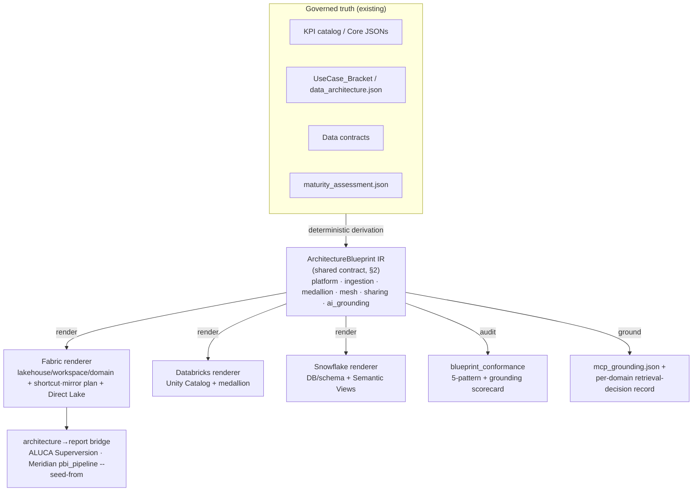

# Architecture Blueprint IR — Shared Contract Spec (draft)

> **Status:** Draft spec (no code). Sharpens the OneLake-AI-era plan:
> ALUCA `ADR-0015` and Freelancing `meridian/.../2026-07-15_onelake-ai-era-blueprint-alignment.md`.
>
> **MIRROR — field-identical across both repos (decision 2026-07-15).** This file is
> maintained **byte-identical** in two places, following the ADR-0005 contract-mirror
> discipline (as with Meridian-Core vendoring):
> - ALUCA: `docs/architecture/research/architecture-blueprint-ir-spec.md`
> - Freelancing: `meridian/docs/research/reporting-platform-blueprints/architecture-blueprint-ir-spec.md`
>
> The **`ArchitectureBlueprint` JSON Schema in §2 is the shared contract** and must not
> diverge between copies; a parity check (like ALUCA `canonical_contract` / Meridian
> `_canonical_mirror`) will enforce this once the layer is built. Everything else is
> explanatory. Build the schema once, mirror it, test parity — do not fork two IRs.

---

## 1. What this is

A governed, deterministic **Intermediate Representation of a data-platform architecture**,
one level *above* the semantic-model/report canonical model both repos already have
(ALUCA `CanonicalModel`, Meridian Core JSONs). Its fields **are** Microsoft's five
OneLake patterns plus the AI-era grounding surface. The same IR renders to multiple
stacks; only the renderer changes.



The three verbs (`render` / `audit` / `ground`) are the reusable standalone tool. The
five patterns are stack-neutral; the per-stack **native-feature mapping** differs (§4).

---

## 2. `ArchitectureBlueprint` JSON Schema (the shared contract)

```json
{
  "$schema": "https://json-schema.org/draft/2020-12/schema",
  "$id": "https://fhc/meridian/architecture-blueprint.schema.json",
  "title": "ArchitectureBlueprint",
  "type": "object",
  "required": ["schema_version", "platform", "medallion", "mesh", "ai_grounding"],
  "additionalProperties": false,
  "properties": {
    "schema_version": { "type": "string", "const": "0.1.0" },

    "platform": {
      "type": "object",
      "description": "P4 Platform Simplification — one platform owns each workload class.",
      "required": ["stack", "ownership_boundaries"],
      "additionalProperties": false,
      "properties": {
        "stack": { "enum": ["fabric", "databricks", "snowflake", "eu_sovereign", "air_gap"] },
        "blueprint_ref": { "type": "integer", "minimum": 1, "maximum": 4,
          "description": "Meridian reporting-platform-blueprint 1–4 (00_index.md); null for ALUCA." },
        "capacity_sku": { "type": "string",
          "description": "Assigned Fabric capacity SKU (e.g. F64). Absent = not assigned; consumers must then state a recommended FLOOR instead of assuming one (Direct-Lake guardrails)." },
        "tier": {
          "enum": ["standard", "enterprise", "business_critical", "vps", "premium"],
          "description": "Edition/plan tier of the target platform — the axis capacity_sku does NOT cover on non-Fabric stacks. Snowflake: standard | enterprise | business_critical | vps (docs.snowflake.com/en/user-guide/intro-editions). Databricks: standard (EOL on AWS 2025-10-01, auto-upgraded to premium) | premium | enterprise; Azure premium corresponds to AWS/GCP enterprise. Absent = unknown, and consumers must NOT assume a tier: replication/failover, PrivateLink, extended Time Travel and predictive optimization each require a specific tier, so an assumed tier produces runbooks the customer cannot execute." },
        "ownership_boundaries": {
          "type": "array",
          "items": {
            "type": "object",
            "required": ["workload_class", "owner_platform"],
            "additionalProperties": false,
            "properties": {
              "workload_class": { "enum": ["ingestion", "transformation", "serving", "ml"] },
              "owner_platform": { "type": "string" }
            }
          }
        }
      }
    },

    "ingestion": {
      "type": "array",
      "description": "P1 Data Access Unification — virtualize, don't duplicate.",
      "items": {
        "type": "object",
        "required": ["source", "access_mode", "rationale"],
        "additionalProperties": false,
        "properties": {
          "source": { "type": "string" },
          "source_system": { "type": "string" },
          "domain": { "type": "string",
            "description": "Owning domain (its name). Carried explicitly so emitters read the owner instead of re-deriving it from a '<domain-slug>_' name prefix — that heuristic silently dropped every source not following the convention (no transform, no copy activity, no warning)." },
          "access_mode": { "enum": ["shortcut", "mirror", "copy"] },
          "rationale": { "type": "string",
            "description": "Why this mode. copy requires perf/isolation/compliance justification." },
          "handover_layer": { "enum": ["raw", "conformed", "semantic", "semantic-zerocopy"],
            "description": "SAP-to-Fabric handover layer: from which layer the source hands off (raw source tables / conformed data product / semantic model / bidirectional zero-copy)." },
          "connector": { "enum": ["odbc-live", "odbc-copy", "hana", "odata", "premium-outbound-shortcut", "mirroring", "sap-cdc", "open-mirroring", "bdc-connect"],
            "description": "Physical handover connector; must be compatible with handover_layer and access_mode (sap_handover_gate)." },
          "sensitivity": { "enum": ["public", "internal", "confidential", "restricted"] }
        }
      }
    },

    "medallion": {
      "type": "object",
      "description": "P2 Medallion — bronze is an immutable system of record; no layer-skipping.",
      "required": ["bronze", "silver", "gold", "no_layer_skip"],
      "additionalProperties": false,
      "properties": {
        "bronze": {
          "type": "object",
          "required": ["enabled", "immutable", "append_only"],
          "additionalProperties": false,
          "properties": {
            "enabled": { "type": "boolean" },
            "outsourced": { "type": "boolean",
              "description": "true = a project/customer owns bronze upstream; still specified, not unscoped." },
            "immutable": { "const": true },
            "append_only": { "const": true },
            "format": { "enum": ["source", "parquet", "delta"], "default": "source" }
          }
        },
        "silver": {
          "type": "object",
          "required": ["data_contract_ref"],
          "additionalProperties": false,
          "properties": {
            "data_contract_ref": { "type": "string" },
            "quality_threshold": { "type": "number", "minimum": 0, "maximum": 1 }
          }
        },
        "gold": {
          "type": "object",
          "required": ["data_products"],
          "additionalProperties": false,
          "properties": {
            "data_products": {
              "type": "array",
              "items": {
                "type": "object",
                "required": ["name", "kind"],
                "additionalProperties": false,
                "properties": {
                  "name": { "type": "string", "pattern": "^(dim|fact|agg)_[a-z0-9_]+$" },
                  "kind": { "enum": ["dimension", "fact", "aggregate"] },
                  "grain": { "type": "string" }
                }
              }
            }
          }
        },
        "platinum": {
          "type": "object",
          "description": "Meridian-only: the semantic-model/ontology layer above gold.",
          "additionalProperties": false,
          "properties": { "semantic_model_ref": { "type": "string" } }
        },
        "no_layer_skip": { "const": true,
          "description": "Shortcuts must not bypass bronze→silver→gold." }
      }
    },

    "mesh": {
      "type": "object",
      "description": "P3 Data Mesh + Governance — domain→workspace topology + data-product publishing.",
      "required": ["domains"],
      "additionalProperties": false,
      "properties": {
        "domains": {
          "type": "array",
          "items": {
            "type": "object",
            "required": ["name", "workspaces", "publishing"],
            "additionalProperties": false,
            "properties": {
              "name": { "type": "string" },
              "workspaces": {
                "type": "array",
                "items": {
                  "type": "object",
                  "required": ["name", "role"],
                  "additionalProperties": false,
                  "properties": {
                    "name": { "type": "string" },
                    "role": { "enum": ["bronze", "silver", "gold", "reporting", "mixed"] }
                  }
                }
              },
              "data_products": { "type": "array", "items": { "type": "string" } },
              "publishing": {
                "type": "object",
                "required": ["endorsement", "intended_audience"],
                "additionalProperties": false,
                "properties": {
                  "catalog": { "type": "boolean", "description": "Registered in OneLake Catalog." },
                  "purview_data_product": { "type": "boolean" },
                  "endorsement": { "enum": ["none", "promoted", "certified"] },
                  "metadata": {
                    "type": "object",
                    "additionalProperties": false,
                    "properties": {
                      "owner": { "type": "string" },
                      "description": { "type": "string" },
                      "tags": { "type": "array", "items": { "type": "string" } }
                    }
                  },
                  "intended_audience": { "enum": ["internal", "partner", "public"] }
                }
              }
            }
          }
        }
      }
    },

    "sharing": {
      "type": "array",
      "description": "P5 External Data Sharing — sanitized, labeled, separate workspace.",
      "items": {
        "type": "object",
        "required": ["external_product", "source_gold_ref", "label", "workspace"],
        "additionalProperties": false,
        "properties": {
          "external_product": { "type": "string" },
          "source_gold_ref": { "type": "string" },
          "sanitization": { "type": "array", "items": { "type": "string" },
            "description": "Masked/removed/reduced fields." },
          "label": { "enum": ["public", "external_use"] },
          "workspace": { "type": "string" }
        }
      }
    },

    "ai_grounding": {
      "type": "object",
      "description": "AI-era — agents ground on gold/silver, never bronze; retrieval-first then MCP.",
      "required": ["grounding_surface", "retrieval"],
      "additionalProperties": false,
      "properties": {
        "grounding_surface": {
          "type": "array",
          "items": { "enum": ["gold", "silver"] },
          "description": "Bronze is intentionally not allowed here."
        },
        "retrieval": {
          "type": "array",
          "items": {
            "type": "object",
            "required": ["domain", "strategy"],
            "additionalProperties": false,
            "properties": {
              "domain": { "type": "string" },
              "strategy": { "enum": ["builtin", "mcp", "both"],
                "description": "builtin (Fabric IQ/Foundry IQ/indexer) first; mcp only for live/action." },
              "certified_sources": { "type": "array", "items": { "type": "string" } },
              "auth_required": { "type": "boolean" }
            }
          }
        },
        "emits": { "type": "array", "items": { "type": "string" }, "default": ["mcp_grounding.json"] },
        "adaptive_gold": {
          "type": "object",
          "description": "Forward-looking: AI materializes hot gold datasets from telemetry (ALUCA ADR-0009 Wirkungs-Loop seed).",
          "additionalProperties": false,
          "properties": {
            "enabled": { "type": "boolean" },
            "source": { "enum": ["fabric_telemetry", "powerbi_telemetry", "wirkungs_loop"] }
          }
        }
      }
    }
  }
}
```

---

## 3. Worked example — one Fabric domain (Commercial / Sales)

A minimal, valid instance (a single domain; a real blueprint carries all domains):

```json
{
  "schema_version": "0.1.0",
  "platform": {
    "stack": "fabric",
    "blueprint_ref": 1,
    "ownership_boundaries": [
      { "workload_class": "ingestion", "owner_platform": "fabric" },
      { "workload_class": "transformation", "owner_platform": "fabric" },
      { "workload_class": "serving", "owner_platform": "fabric" }
    ]
  },
  "ingestion": [
    { "source": "crm_orders", "source_system": "Dynamics 365", "access_mode": "mirror",
      "rationale": "Azure DB — mirroring for reliable, isolated analytics copy", "sensitivity": "internal" },
    { "source": "web_events", "source_system": "ADLS Gen2", "access_mode": "shortcut",
      "rationale": "Already a lake; virtualize zero-copy", "sensitivity": "internal" }
  ],
  "medallion": {
    "bronze": { "enabled": true, "outsourced": false, "immutable": true, "append_only": true, "format": "delta" },
    "silver": { "data_contract_ref": "core/data_contracts/domains/commercial.yaml", "quality_threshold": 0.98 },
    "gold": { "data_products": [
      { "name": "dim_customer", "kind": "dimension", "grain": "one row per customer" },
      { "name": "fact_sales", "kind": "fact", "grain": "one row per order line" },
      { "name": "agg_margin_by_region", "kind": "aggregate", "grain": "region × month" }
    ] },
    "platinum": { "semantic_model_ref": "Commercial.SemanticModel" },
    "no_layer_skip": true
  },
  "mesh": {
    "domains": [
      { "name": "Commercial",
        "workspaces": [
          { "name": "ws-commercial-engineering", "role": "mixed" },
          { "name": "ws-commercial-gold", "role": "gold" },
          { "name": "ws-commercial-reporting", "role": "reporting" }
        ],
        "data_products": ["dim_customer", "fact_sales", "agg_margin_by_region"],
        "publishing": {
          "catalog": true, "purview_data_product": true, "endorsement": "certified",
          "metadata": { "owner": "Commercial COE", "description": "Certified sales gold products",
            "tags": ["commercial", "sales"] },
          "intended_audience": "internal"
        }
      }
    ]
  },
  "sharing": [],
  "ai_grounding": {
    "grounding_surface": ["gold", "silver"],
    "retrieval": [
      { "domain": "Commercial", "strategy": "builtin",
        "certified_sources": ["agg_margin_by_region", "fact_sales"], "auth_required": true }
    ],
    "emits": ["mcp_grounding.json"],
    "adaptive_gold": { "enabled": false, "source": "wirkungs_loop" }
  }
}
```

**What the three verbs produce from this instance**

- **`render` (Fabric):** a `ws-commercial-gold` lakehouse holding `dim_customer` /
  `fact_sales` / `agg_margin_by_region` as Delta tables; a **mirror** for `crm_orders`
  and a **shortcut** for `web_events` in the bronze area (single physical copy, zero-copy
  distribution); a Direct-Lake `Commercial.SemanticModel` bound to gold; a domain →
  three-workspace layout. (Provisioning reuses Meridian `blueprint1`; ALUCA emits via a
  `targets/arch_fabric` adapter under the ADR-0006 contract.)
- **`audit` (blueprint_conformance scorecard):**

  | Pattern | Verdict | Evidence |
  |---|---|---|
  | P1 Access Unification | 🟢 | every source has an explicit mode + rationale; no unjustified copy |
  | P2 Medallion | 🟢 | bronze immutable+append-only; `no_layer_skip=true`; gold naming valid |
  | P3 Data Mesh + Publishing | 🟢 | domain→workspaces set; certified + Purview + audience declared |
  | P4 Platform Simplification | 🟢 | one owner per workload class; single stack |
  | P5 External Sharing | ⚪ n/a | no external products in this domain |
  | AI Grounding | 🟢 | surface = gold/silver only; retrieval builtin-first; auth required |

- **`ground`:** `mcp_grounding.json` pointing agents at the three gold products + a
  per-domain retrieval record ("Commercial → builtin/Fabric IQ, certified sources
  fact_sales & agg_margin_by_region, auth required"). Reuses Meridian M5
  (`meridian_copilot_readiness`) / ALUCA GADW Stage 5.

---

## 4. Same IR, other stacks (cross-stack mapping)

The instance above is stack-neutral except `platform.stack`. Switching it re-targets the
renderer; the five patterns and the audit are unchanged.

| IR concept | Fabric | Databricks | Snowflake |
|---|---|---|---|
| Access unification | OneLake shortcut / mirror | Unity Catalog external location / Lakehouse Federation | External table / Iceberg / share |
| Medallion store | Lakehouse Delta (bronze/silver/gold) | UC catalog `bronze`/`silver`/`gold` schemas | DB schemas `BRONZE`/`SILVER`/`GOLD` |
| Domain → workspace | Fabric domain → workspaces | UC catalog → schemas + groups | Account → DB/role hierarchy |
| Publishing / catalog | OneLake Catalog + Purview + endorsement | Unity Catalog + tags + certification | Horizon + object tags |
| Semantic / grounding | Direct Lake model + Fabric IQ | Genie metric views + synonyms | Semantic Views + synonyms |
| Grounding emit | `mcp_grounding.json` (tool-free) | same | same |

Meridian additionally selects **blueprint 1–4** (`platform.blueprint_ref`) via its existing
`00_index.md` decision tree — the EU-sovereign (3) and air-gap (4) variants reuse the same
IR with non-MS renderers, honoring the K1–K13 gaps (e.g. K6 label persistence).

---

## 5. Derivation mapping (deterministic, no LLM)

The IR is **derived**, never hand-authored. The contract (§2) is shared; the *source of
truth* differs per repo, so the mapping is one table keyed by IR field with a column per
repo. Same field, same meaning — different upstream. Every rule is deterministic (same
input → same output); anything genuinely underspecified is emitted as an explicit HITL
gap, never guessed (consistent with the KPI-DSL `hitl` and `UNCOMPUTED` honesty rules).

| IR field | ALUCA source of truth | Meridian source of truth | Derivation rule |
|---|---|---|---|
| `platform.stack` | Superversion target selection (default `fabric`) | Stack decision tree → `data_architecture.json` | Chosen target/stack; `fabric` default. |
| `platform.blueprint_ref` | `null` (single-stack home) | Blueprint 1–4 from `00_index.md` decision tree | Meridian-only; ALUCA leaves null. |
| `platform.ownership_boundaries` | Implicit (Fabric owns all) unless multi-target | `data_architecture.json` platform section | One owner per workload class; default all = chosen stack. |
| `ingestion[].source` / `source_system` | `core/data_contracts/sources/*` | `data_architecture.json` `source_system` | One row per external source. |
| `ingestion[].access_mode` | Heuristic: lake source → `shortcut`, DB → `mirror`; `copy` needs explicit reason | New per-source field on `data_architecture.json` | Default `shortcut`; `mirror` for Azure DB; `copy` requires rationale. |
| `medallion.bronze` | `data_layers_standard.md` → default `enabled=false, outsourced=true` (silver-first) unless a project adds bronze | `data_architecture.json` `tables.bronze` presence | `immutable`/`append_only` fixed true; outsourced bronze stays *specified*, not unscoped. |
| `medallion.silver.data_contract_ref` | `UseCase_Bracket.overrides.data_contract_ref` → `core/data_contracts/domains/<domain>.yaml` | `data_architecture.json` silver / `data_contract` | Reference only (Golden Thread: never redefine). |
| `medallion.silver.quality_threshold` | Data-contract quality rules | `data_architecture.json` `quality_threshold` | Pass-through. |
| `medallion.gold.data_products` | KPI catalog + `core/semantic_models/domains/*` → `dim_`/`fact_`/`agg_` | `data_architecture.json` `tables.gold` (`derive_dimensions`) | Name pattern `^(dim\|fact\|agg)_`; `kind`/`grain` from the star schema. |
| `medallion.platinum.semantic_model_ref` | Generated `<Domain>.SemanticModel` (Superversion `tmdl`) | `derive_fabric` semantic model (Platinum) | Meridian-primary; ALUCA populates when a model is emitted. |
| `mesh.domains[].name` | 5 core domains (Commercial/Finance/Operations/SupplyChain/Experience) | `data_architecture.json` domains | One entry per business domain. |
| `mesh.domains[].workspaces` | Convention `ws-<domain>-<role>` from domain × layer | `provisioning/blueprint1` workspace layout | Deterministic naming; `role` from medallion layer. |
| `mesh.domains[].publishing` | `endorsement` from `UseCase_Bracket.readiness`; `intended_audience` default `internal` | `data_product_scorecard` / `dataarch` publishing rules | Certified only when readiness/scorecard clears; else `promoted`/`none`. |
| `sharing[]` | Opt-in; default empty | Opt-in; default empty | Only when an external product is declared (sanitized + labeled). |
| `ai_grounding.grounding_surface` | Fixed `[gold, silver]` (`ai_readiness.md`) | Fixed `[gold, silver]` (M5 doctrine) | Constant by doctrine — bronze never allowed. |
| `ai_grounding.retrieval` | Per-domain, default `builtin` (GADW Stage 5) | Per-domain (`meridian_copilot_readiness`) | `builtin` first; `mcp` only where live/action declared. |
| `ai_grounding.emits` | `["mcp_grounding.json"]` | `["mcp_grounding.json"]` (M5 emits it today) | Constant; tool-free file. |
| `ai_grounding.adaptive_gold` | Default off; source `wirkungs_loop` (ADR-0009 telemetry) | Default off; source telemetry | Off until a custom telemetry agent exists. |

## 6. Parity check (keeping the two mirrors honest)

The **§2 JSON Schema block is the single shared artifact**; the parity check guards it,
mirroring the existing ALUCA `canonical_contract` / Meridian `_canonical_mirror` pattern
(ADR-0005/0036 — a parity-gated standalone mirror):

1. Extract the fenced ` ```json ` schema block from `architecture-blueprint-ir-spec.md`.
2. Canonicalize (parse → re-serialize with sorted keys) and `sha256` it.
3. The two repos' hashes **must match**; a mismatch fails each repo's check suite
   (ALUCA alongside `check_index`; Meridian in `make check`).
4. **Interim guard until built:** a manual `md5sum` of the two whole files (as run
   2026-07-15 — one distinct hash). A schema change is one logical edit applied to both
   copies in lockstep, in a paired commit.

## 7. `schema_version` bump policy

Pre-1.0 the IR carries `schema_version` `0.MINOR.PATCH`:

- **Additive / safe** (new optional field, new enum value with a safe default) → **patch**
  (`0.1.0 → 0.1.1`). Renderers ignore unknown-but-optional input tolerantly.
- **Breaking** (rename/remove a field, tighten `required`, remove an enum value) →
  **minor** (`0.1.x → 0.2.0`) with a migration note in both alignment docs.
- **Both repos bump in the same commit-pair.** A version skew between the mirrors is
  itself a parity failure (§6).
- Rendered artifacts and audit scorecards **record the `schema_version` they were
  produced against** (provenance), consistent with ALUCA attestation / Meridian
  `pbi_gatekeeper --attest`.

## 8. Still open (before code)

- The **field-level tie-back** for a few Meridian fields that need a *new* attribute on
  `data_architecture.json` (`ingestion[].access_mode`) — additive schema change, paired
  with a `schema_version` patch.
- Whether `render` provisioning stays plan-only (emitting a runbook) vs. live `fab`
  provisioning — gated by tenant access, like the existing Premium-floor F1/F6 caveats.
