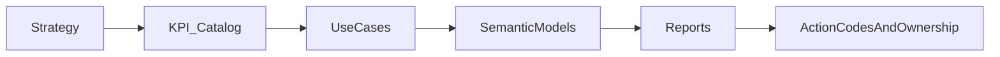

# ActionReady Analytics Platform — Executive One-Pager

## Why this matters now

Most analytics programs fail for structural reasons, not tooling reasons:

- KPI definitions are debated, so trust is low.
- Reports describe deviations, but do not trigger accountable action.
- Teams duplicate logic and rebuild semantics for every new request.
- AI initiatives start without governed semantic foundations.

Result: slow decisions, high rework, and analytics that behaves like a cost center.

## What this platform delivers

- **Strategy-to-action traceability:** Every KPI, report element, and action traces back to business intent.
- **Decision-first analytics:** Use cases are organized around decisions and actions, not dashboard pages.
- **Single source of truth:** One KPI catalog and governed measure system for business, BI, and AI.
- **Fast adoption:** From Silver-layer input to first governed report package in one day.
- **Scalable product model:** Tool-agnostic core plus platform-specific products (starting with Fabric/Power BI).

## How it works (Golden Thread)

## Included assets (today)

- 15 core use cases across key business domains
- 90+ governed KPIs in a central catalog
- Action code logic with triggers and ownership
- Core semantic model blueprint and domain measure dictionaries
- Stage 1 quality gate plus platform checks for Fabric/Power BI

## Proof point: Aurora Group

The Aurora Group showcase demonstrates the framework end-to-end with synthetic enterprise data.  
It validates that strategy, KPI governance, semantic model, and action-ready reporting work as one integrated system.

## Engagement options

1. **Framework only:** Use the method and governance model to build your own analytics products.
2. **Framework + productized reports:** Adopt pre-built report packages for faster time-to-value.
3. **Hybrid:** Start with pre-built assets and extend selectively where needed.

## Decision

Adopt the ActionReady model as the standard operating system for analytics delivery to reduce semantic drift, increase decision speed, and make outcomes auditable at scale.
