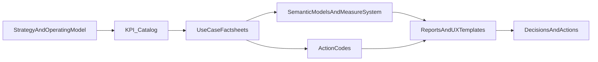
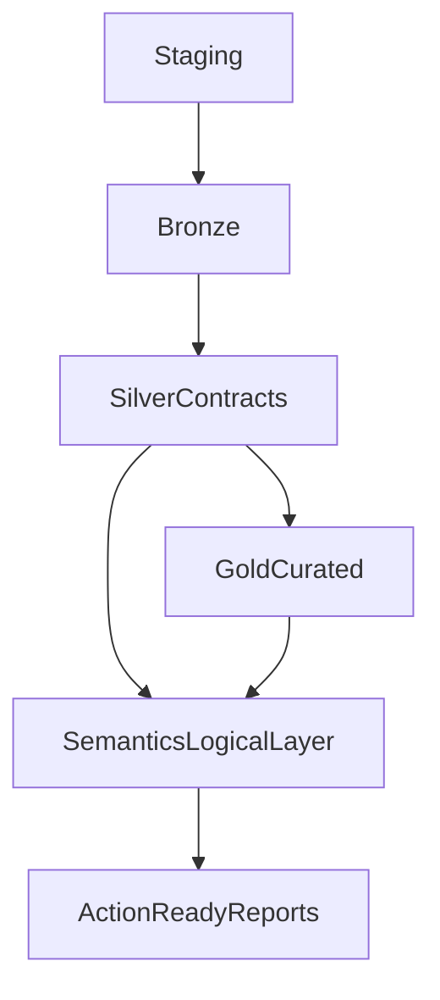

# ActionReady Analytics Platform — Comprehensive Framework Overview

## 1. Executive summary

This framework turns analytics into a reliable steering capability by enforcing a governed path from strategy to action.  
It combines:

- a tool-agnostic core (strategy, KPIs, use cases, action codes, semantics),
- platform products (starting with Microsoft Fabric/Power BI),
- automated quality gates (Stage 1 + platform checks),
- and reference implementations (Aurora Group) to accelerate adoption.

The goal is not more reporting. The goal is faster, better, and accountable decisions.

## 2. Why typical analytics initiatives underperform

Most organizations have data and dashboards but still struggle to steer reliably.

Common failure patterns:

- KPI definitions vary by report and by team.
- Business and technical interpretations diverge over time.
- Reporting is descriptive, not action-oriented.
- New requirements create new logic instead of reuse.
- AI usage starts without stable semantic contracts.

Business impact:

- low KPI trust,
- slow decision cycles,
- recurring reconciliation discussions,
- high delivery cost,
- weak scalability.

## 3. The ActionReady approach

The framework enforces a Golden Thread from business intent to operational action.



Core principles:

- **Separation of concerns:** core framework remains tool-agnostic.
- **Single source of truth:** KPI meaning and action logic are centrally governed.
- **Generated vs source separation:** generated artifacts are isolated from defining assets.
- **Deterministic automation:** repeatable generation and validation through scripts and checks.
- **Auditability:** every output can be traced to governed definitions.

## 4. Architecture and data layer standard

The framework standardizes analytics around **4 physical layers + 1 logical layer**:

1. Staging/Landing (physical)
2. Bronze (physical)
3. Silver (physical, conformed and contract-defined)
4. Gold (physical, consumption-ready)
5. Semantics (logical: KPI catalog, measure logic, action codes, semantic definitions)

Delivery scope in this repository:

- Silver is **defined** via contracts.
- Gold + Semantics are **delivered** through semantic models and report products.
- Staging and Bronze are out of scope unless explicitly required.



## 5. What is included

### 5.1 Core framework (tool-agnostic)

- Strategy and operating model documents
- KPI catalog and taxonomy
- Core use case library with business and technical factsheets
- Action codes and decision spine mapping
- Semantic model blueprint and domain measure dictionaries
- Data contracts and templates
- Governance conventions and metadata (KPI catalog, measure descriptions, model metadata)

### 5.2 Platform product (Microsoft Fabric/Power BI)

- Implementation guides
- Deployment automation templates
- Page/report scaffolding tooling
- Theme and report tooling
- Fabric-specific validation checks
- Dist outputs (TMDL/PBIP artifacts)

### 5.3 Quality gates

- **Stage 1** (mandatory): schema/consistency/governance validation
- **Fabric checks**: semantic/report quality checks for platform artifacts

## 6. How delivery works in practice

The operating procedure is intentionally simple and repeatable:

1. Select strategic pattern and target outcomes
2. Prioritize use case pack
3. Confirm required KPI set and owners
4. Define/validate Silver contracts
5. Generate/implement semantic model and measures
6. Build action-ready report pages and run quality gates

Expected Day-1 outcome:

- first governed report package from Silver input,
- quality gates passing,
- clear action linkage and ownership.

## 7. Engagement models

Organizations can adopt the framework in three ways:

1. **Methodology only**  
   Use framework governance and procedures; build implementation assets internally or with partner teams.

2. **Methodology + standardized products**  
   Use framework plus pre-built report and semantic assets for faster rollout.

3. **Hybrid**  
   Start with standardized products and extend where business specificity requires.

## 8. Proof point: Aurora Group showcase

Aurora Group is the reference implementation that demonstrates full end-to-end viability.

What it proves:

- governed KPI catalog to semantic model flow,
- use case driven reporting aligned with 3-30-300 principles,
- actionable report patterns connected to action codes,
- automated checks that support delivery quality and maintainability.

Aurora is used as evidence of practical delivery, not as the architecture constraint for future products.

## 9. Why this is different from traditional BI programs

| Dimension | Typical BI Program | ActionReady Framework |
|---|---|---|
| KPI semantics | Reinterpreted across teams | Central KPI catalog + measure governance |
| Delivery model | Dashboard backlog | Use case and decision backlog |
| Action linkage | Often implicit | Explicit action code integration |
| Governance | Manual and fragmented | Automated quality gates and standards |
| Scalability | Logic duplication | Reuse via templates and governed semantics |
| AI readiness | Ad hoc prompts over raw data | AI-ready semantic contracts and metadata |

## 10. Adoption path and next steps

Recommended rollout:

1. Align leadership on target outcomes and first domain scope
2. Select first use case cluster and define success criteria
3. Run playbook for strategy-to-first-report
4. Use Aurora as reference, not as copy template
5. Institutionalize Stage 1 + platform checks in CI
6. Expand by product packs and domain increments

Near-term decision required:

- choose first product scope (Fabric/Power BI as baseline),
- approve governance and CI gates as non-negotiable,
- start with one high-value domain to prove time-to-value.

## 11. Appendix: repository orientation

Target structure aligns with productization and governance:

```yaml
core/            # Tool-agnostic framework and SSOT assets
products/        # Platform/domain-specific products
tooling/         # Shared generation, validation, schemas
showcases/       # End-to-end reference implementations
docs/            # Audience entry points and architecture
internal/        # Maintainer-only CI, strategy, archive
```

This structure supports multi-product scaling without weakening governance.
