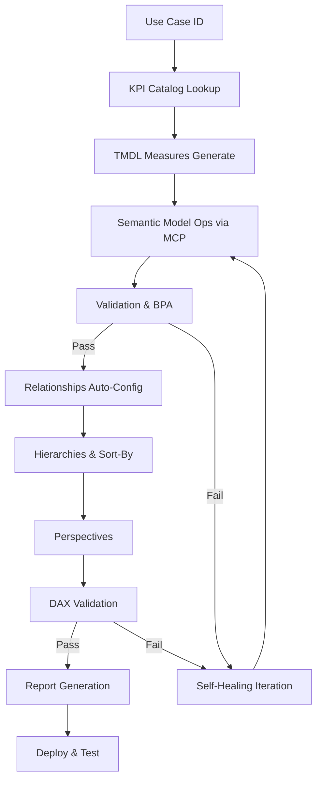

# Power BI MCP - Automated Self-Iterating Flow

## Vision: KPI Catalog → Semantic Model → Reports (Fully Automated)

**Ziel:** Von Use Case ID bis zum fertigen Report ohne manuelle Intervention - mit selbst-korrigierendem Feedback-Loop.

Technical TODOs for this flow are listed in [internal/technical_backlog.md](../../internal/technical_backlog.md) § Power BI MCP.

---

## 🎯 **End-to-End Flow Overview**



---

## 📦 **Phase 1: Setup & Connection (Einmalig)**

### 1.1 Power BI MCP Connection etablieren

**Prerequisites:**
- Power BI Desktop installiert (mit TMDL View Support)
- Analysis Services TMDL Extension für VS Code
- PBIP-Projekt im Git-Repo

**Connection Setup Script:**
```powershell
# tooling/powerbi_mcp/setup_connection.ps1

Param(
    [string]$WorkspaceRoot = "showcases/aurora_group/semantic_models",
    [string]$ModelName = "Commercial",
    [string]$ConnectionName = "local_pbip"
)

Write-Host "=== Power BI MCP Connection Setup ===" -ForegroundColor Cyan

# 1. Stelle sicher dass PBIP-Struktur existiert
$modelPath = Join-Path $WorkspaceRoot "$ModelName.SemanticModel"
if (-not (Test-Path $modelPath)) {
    Write-Host "Creating PBIP structure..." -ForegroundColor Yellow
    New-Item -ItemType Directory -Path "$modelPath\definition\tables" -Force | Out-Null
    New-Item -ItemType Directory -Path "$modelPath\definition\relationships" -Force | Out-Null
    
    # model.tmdl erstellen
    @"
model Model
  culture: de-DE
  defaultPowerBIDataSourceVersion: PowerBI_V3

"@ | Out-File -Encoding UTF8NoBOM "$modelPath\definition\model.tmdl"
    
    # .platform erstellen
    @"
{
  "`$schema": "https://developer.microsoft.com/json-schemas/fabric/gitIntegration/platformProperties/2.0.0/schema.json",
  "metadata": {
    "type": "SemanticModel",
    "displayName": "$ModelName"
  },
  "config": {
    "version": "2.0",
    "logicalId": "$(New-Guid)"
  }
}
"@ | Out-File -Encoding UTF8NoBOM "$modelPath\.platform"
}

Write-Host "✓ PBIP structure ready: $modelPath" -ForegroundColor Green

# 2. Connection Details ausgeben
Write-Host "`nPower BI MCP Connection Details:" -ForegroundColor Cyan
Write-Host "  Connection Name: $ConnectionName" -ForegroundColor Gray
Write-Host "  Model Path:      $modelPath" -ForegroundColor Gray
Write-Host "  Definition Path: $modelPath\definition" -ForegroundColor Gray

# 3. Connection-Datei erstellen
$connFile = "tooling/powerbi_mcp/connections.json"
$conn = @{
    $ConnectionName = @{
        modelPath = $modelPath
        definitionPath = "$modelPath\definition"
        lastUsed = (Get-Date -Format "yyyy-MM-dd HH:mm:ss")
    }
}
$conn | ConvertTo-Json -Depth 5 | Out-File -Encoding UTF8NoBOM $connFile

Write-Host "`n✓ Connection saved: $connFile" -ForegroundColor Green
Write-Host "`nNext Steps:" -ForegroundColor Yellow
Write-Host "  1. Run: ./tooling/powerbi_mcp/orchestrate_full_model.ps1 -UseCase 'COM-001'" -ForegroundColor Gray
```

---

## 🔄 **Phase 2: Orchestration - Self-Iterating Flow**

### 2.1 Master Orchestrator

**File:** `tooling/powerbi_mcp/orchestrate_full_model.ps1`

```powershell
Param(
    [Parameter(Mandatory=$true)][string]$UseCase,
    [string]$ConnectionName = "local_pbip",
    [int]$MaxIterations = 5,
    [switch]$DryRun
)

$ErrorActionPreference = "Stop"

Write-Host "========================================" -ForegroundColor Cyan
Write-Host "Power BI MCP - Full Model Orchestration" -ForegroundColor Cyan
Write-Host "========================================" -ForegroundColor Cyan
Write-Host "Use Case:     $UseCase" -ForegroundColor Gray
Write-Host "Connection:   $ConnectionName" -ForegroundColor Gray
Write-Host "Max Iterations: $MaxIterations" -ForegroundColor Gray
Write-Host ""

# State Tracking
$state = @{
    useCase = $UseCase
    iteration = 0
    phase = "init"
    errors = @()
    warnings = @()
    completed = @()
}

function Log-Phase {
    param([string]$Phase, [string]$Status = "START")
    $color = switch($Status) {
        "START" { "Cyan" }
        "PASS" { "Green" }
        "WARN" { "Yellow" }
        "FAIL" { "Red" }
    }
    Write-Host "[$($state.iteration)] $Phase - $Status" -ForegroundColor $color
}

function Invoke-WithRetry {
    param(
        [string]$PhaseName,
        [scriptblock]$Script,
        [int]$MaxRetries = 3
    )
    
    for ($i = 0; $i -lt $MaxRetries; $i++) {
        try {
            Log-Phase $PhaseName "START"
            & $Script
            Log-Phase $PhaseName "PASS"
            $state.completed += $PhaseName
            return $true
        } catch {
            $state.errors += @{
                phase = $PhaseName
                iteration = $state.iteration
                error = $_.Exception.Message
            }
            Log-Phase $PhaseName "FAIL"
            Write-Host "  Error: $($_.Exception.Message)" -ForegroundColor Red
            
            if ($i -lt ($MaxRetries - 1)) {
                Write-Host "  Retrying ($($i+1)/$MaxRetries)..." -ForegroundColor Yellow
                Start-Sleep -Seconds 2
            }
        }
    }
    return $false
}

# ===========================================
# PHASE 1: DATA FOUNDATION
# ===========================================
$state.phase = "data_foundation"
$state.iteration = 1

Invoke-WithRetry "Check Aurora Data" {
    $dataPath = "showcases\aurora_group\data\gold"
    if (-not (Test-Path $dataPath)) {
        throw "Aurora data not found at $dataPath"
    }
    $dims = @("dim_date", "dim_org", "dim_product", "dim_customer", "dim_promo", "dim_account")
    $facts = @("fact_sales", "fact_sales_budget", "fact_action_log", "fact_gl_journal")
    
    foreach ($dim in $dims) {
        if (-not (Test-Path "$dataPath\dimensions\$dim")) {
            throw "Missing dimension: $dim"
        }
    }
    foreach ($fact in $facts) {
        if (-not (Test-Path "$dataPath\facts\$fact")) {
            throw "Missing fact: $fact"
        }
    }
    Write-Host "  ✓ All required tables present" -ForegroundColor Green
}

# ===========================================
# PHASE 2: KPI CATALOG & MEASURE GENERATION
# ===========================================
$state.phase = "measure_generation"
$state.iteration = 2

Invoke-WithRetry "Generate TMDL Measures" {
    $result = & ./tooling/generation/generate_tmdl_measures.ps1 `
        -UseCase $UseCase `
        -UseCasesRoot "core/usecases/core" `
        -KpiCatalogRoot "core/kpi_catalog" `
        -DistRoot "products/fabric_powerbi/dist" `
        -OverwriteExisting
    
    if ($LASTEXITCODE -ne 0) {
        throw "Measure generation failed with exit code $LASTEXITCODE"
    }
    Write-Host "  ✓ Measures generated" -ForegroundColor Green
}

Invoke-WithRetry "Validate TMDL Syntax" {
    $tmdlFile = "dist\$UseCase\$UseCase.SemanticModel\definition\tables\_Measures.tmdl"
    $result = & ./products/fabric_powerbi/tooling/test_tmdl.ps1 -TmdlFile $tmdlFile
    
    if ($LASTEXITCODE -ne 0) {
        throw "TMDL validation failed"
    }
    Write-Host "  ✓ TMDL syntax valid" -ForegroundColor Green
}

# ===========================================
# PHASE 3: SEMANTIC MODEL OPERATIONS (MCP)
# ===========================================
$state.phase = "semantic_model_build"
$state.iteration = 3

# 3.1 Create Tables from Data Contracts → table_ops.ps1 -Operation CreateFromContract (or ExportFromContract for JSON)
#     orchestrate_full_model.ps1 calls table_ops.ps1 per required table; payload written to tooling/powerbi_mcp/out/table_ops_<UseCase>.json
# 3.2 Create Relationships → relationship_ops.ps1 -Operation CreateFromBracket -BracketPath <path> -OutJsonPath out/relationship_ops_<UseCase>.json
# 3.3 Create Hierarchies → hierarchy_ops.ps1 -Operation FromBracket -BracketPath <path> -OutJsonPath out/hierarchy_ops_<UseCase>.json

# 3.4 Import Measures
Invoke-WithRetry "Import Measures to Model" {
    $measuresFile = "products\fabric_powerbi\dist\$UseCase\$UseCase.SemanticModel\definition\tables\_Measures.tmdl"
    
    # Copy measures to working model
    $targetModel = "showcases\aurora_group\semantic_models\Commercial.SemanticModel"
    $targetMeasures = "$targetModel\definition\tables\_Measures.tmdl"
    
    if (Test-Path $measuresFile) {
        Copy-Item $measuresFile $targetMeasures -Force
        Write-Host "  ✓ Measures imported" -ForegroundColor Green
    }
}

# ===========================================
# PHASE 4: VALIDATION & SELF-HEALING
# ===========================================
$state.phase = "validation"
$state.iteration = 4

$validationPassed = $false
$iterationCount = 0

while (-not $validationPassed -and $iterationCount -lt $MaxIterations) {
    $iterationCount++
    Write-Host "`n=== Validation Iteration $iterationCount ===" -ForegroundColor Cyan
    
    # Run BPA
    $bpaResult = Invoke-WithRetry "Run BPA Checks" {
        $bpaOutput = & ./tooling/run_all_checks.ps1 2>&1
        
        # Parse BPA output for errors
        $errors = $bpaOutput | Select-String -Pattern "ERROR|FAIL" -AllMatches
        
        if ($errors.Count -gt 0) {
            throw "BPA found $($errors.Count) errors"
        }
        Write-Host "  ✓ BPA checks passed" -ForegroundColor Green
    }
    
    if ($bpaResult) {
        $validationPassed = $true
    } else {
        Write-Host "  Analyzing errors for auto-correction..." -ForegroundColor Yellow
        
        # Self-Healing Logic
        foreach ($error in $state.errors | Where-Object { $_.iteration -eq $iterationCount }) {
            switch -Regex ($error.error) {
                "Missing formatString" {
                    Write-Host "  → Auto-fix: Adding default formatString" -ForegroundColor Yellow
                    # TODO: Update TMDL file with default format strings
                }
                "Missing displayFolder" {
                    Write-Host "  → Auto-fix: Adding default displayFolder" -ForegroundColor Yellow
                    # TODO: Update TMDL file with default folders
                }
                "Relationship cardinality" {
                    Write-Host "  → Auto-fix: Correcting relationship" -ForegroundColor Yellow
                    # TODO: Update relationship via MCP
                }
                default {
                    Write-Host "  → Manual intervention required: $($error.error)" -ForegroundColor Red
                }
            }
        }
        
        Start-Sleep -Seconds 2
    }
}

if (-not $validationPassed) {
    Write-Host "`n✗ Validation failed after $MaxIterations iterations" -ForegroundColor Red
    exit 1
}

# ===========================================
# PHASE 5: REPORT GENERATION
# ===========================================
$state.phase = "report_generation"
$state.iteration = 5

Invoke-WithRetry "Generate Report from Template" {
    # report_generator.ps1 -UseCase $UseCase -TemplateName (from Business_Factsheet page_template) -OutputPath dist
    # Reads core/templates/page_templates/components/<TemplateName>.json, writes <UseCase>.Report/definition/report.json
    & ./tooling/powerbi_mcp/report_generator.ps1 -UseCase $UseCase -TemplateName $template -OutputPath $distReportRoot
    Write-Host "  ✓ Report structure created" -ForegroundColor Green
}

# ===========================================
# FINAL SUMMARY
# ===========================================
Write-Host "`n========================================" -ForegroundColor Green
Write-Host "✓ Model Orchestration Complete!" -ForegroundColor Green
Write-Host "========================================" -ForegroundColor Green
Write-Host "Use Case:      $UseCase" -ForegroundColor Gray
Write-Host "Iterations:    $($state.iteration)" -ForegroundColor Gray
Write-Host "Completed:     $($state.completed.Count) phases" -ForegroundColor Gray
Write-Host "Errors Fixed:  $($state.errors.Count)" -ForegroundColor Gray
Write-Host "`nOutput:" -ForegroundColor Cyan
Write-Host "  Model:  showcases\aurora_group\semantic_models\<Domain>.SemanticModel" -ForegroundColor Gray
Write-Host "  Report: showcases\aurora_group\reports\$UseCase.Report" -ForegroundColor Gray
Write-Host "`nNext Steps:" -ForegroundColor Yellow
Write-Host "  1. Open in Power BI Desktop: explorer showcases\aurora_group\semantic_models" -ForegroundColor Gray
Write-Host "  2. Validate visually" -ForegroundColor Gray
Write-Host "  3. Publish to Fabric Workspace" -ForegroundColor Gray
```

---

## 🔧 **Phase 3: Power BI MCP Integration Layer**

### 3.1 Table Operations Wrapper

**File:** `tooling/powerbi_mcp/table_ops.ps1`

```powershell
Param(
    [ValidateSet("Create","Update","Delete","Get","List")]
    [string]$Operation,
    [string]$ConnectionName = "local_pbip",
    [hashtable]$TableDefinition
)

# Wrapper für mcp_powerbi-model_table_operations
# Konvertiert Data Contract YAML → TMDL Table Definition

function Convert-DataContractToTableDef {
    param($Contract)
    
    $tableDef = @{
        name = $Contract.name
        description = $Contract.description
        columns = @()
    }
    
    foreach ($col in $Contract.columns) {
        $tableDef.columns += @{
            name = $col.name
            dataType = $col.type  # int64, string, date, decimal, etc.
            description = $col.description
            isHidden = ($col.role -eq "key")
            formatString = if ($col.format) { $col.format } else { "" }
        }
    }
    
    return $tableDef
}

# Execute MCP Operation
$request = @{
    connectionName = $ConnectionName
    operation = $Operation.ToLower()
}

if ($TableDefinition) {
    $request.createDefinition = Convert-DataContractToTableDef $TableDefinition
}

# Call Power BI MCP
# mcp_powerbi-model_table_operations -request $request
```

### 3.2 Relationship Operations Wrapper

**File:** `tooling/powerbi_mcp/relationship_ops.ps1`

```powershell
# Auto-detect relationships from:
# 1. UseCase_Bracket.yaml + data contract references (explicit)
# 2. Foreign Key naming conventions (implicit)
# 3. Data Contract lineage (inferred)

function Get-RelationshipsFromBracket {
    param([string]$BracketPath)
    
    $content = Get-Content $BracketPath -Raw | ConvertFrom-Yaml
    $dataContractRef = $content.overrides.data_contract_ref
    
    if ($dataContractRef -and (Test-Path $dataContractRef)) {
        # Parse data contract for relationship definitions
        # Return array of relationship objects
    }
}

function Auto-DetectRelationships {
    param([array]$Tables)
    
    $relationships = @()
    
    # Heuristic 1: *Key columns
    foreach ($fact in ($Tables | Where-Object { $_.type -eq "fact" })) {
        foreach ($col in $fact.columns) {
            if ($col.name -match '^(.+)Key$') {
                $dimName = "dim_" + $matches[1].ToLower()
                $dim = $Tables | Where-Object { $_.name -eq $dimName }
                
                if ($dim) {
                    $relationships += @{
                        from = $fact.name
                        fromColumn = $col.name
                        to = $dim.name
                        toColumn = $col.name
                        cardinality = "ManyToOne"
                        crossFilteringBehavior = "single"
                    }
                }
            }
        }
    }
    
    return $relationships
}
```

### 3.3 Measure Operations Wrapper

**File:** `tooling/powerbi_mcp/measure_ops.ps1`

```powershell
# Import measures from TMDL into model via MCP
# Parse _Measures.tmdl → Extract measure blocks → Create via MCP

function Import-MeasuresFromTMDL {
    param(
        [string]$TmdlFile,
        [string]$ConnectionName
    )
    
    $content = Get-Content $TmdlFile -Raw
    
    # Parse measure blocks
    $pattern = '(?ms)///\s*(.+?)\s*measure\s+''([^'']+)''\s*=\s*(.+?)(?=\n\s*(?:///|measure|$))'
    $matches = [regex]::Matches($content, $pattern)
    
    foreach ($match in $matches) {
        $description = $match.Groups[1].Value.Trim()
        $name = $match.Groups[2].Value
        $expression = $match.Groups[3].Value.Trim()
        
        # Extract formatString, displayFolder from expression
        $formatMatch = [regex]::Match($expression, 'formatString:\s*"([^"]+)"')
        $folderMatch = [regex]::Match($expression, 'displayFolder:\s*"([^"]+)"')
        
        $measureDef = @{
            name = $name
            expression = $expression
            description = $description
            formatString = if ($formatMatch.Success) { $formatMatch.Groups[1].Value } else { "" }
            displayFolder = if ($folderMatch.Success) { $folderMatch.Groups[1].Value } else { "00_General" }
        }
        
        # Create via MCP
        # mcp_powerbi-model_measure_operations -Operation Create -MeasureDefinition $measureDef
    }
}
```

---

## 🎨 **Phase 4: Report Template Engine**

### 4.1 Page Template Parser

**File:** `tooling/powerbi_mcp/report_generator.ps1`

```powershell
Param(
    [string]$UseCase,
    [string]$TemplateName = "overview_drivers_details",
    [string]$OutputPath
)

# Parse core/templates/page_templates/$TemplateName.md
# Generate PBIR JSON structure

function Parse-PageTemplate {
    param([string]$TemplatePath)
    
    $template = Get-Content $TemplatePath -Raw | ConvertFrom-Markdown
    
    $pages = @()
    
    # Extract page definitions
    # Example:
    # ## Page 1: Overview (3 seconds)
    # - KPI Cards: Net Sales, Gross Margin %, Price Realization %
    # - Trend Chart: Net Sales (Last 12M)
    # - Sparklines: GM% vs Plan
    
    return @{
        pages = $pages
        filters = @()  # From Use Case filters_default
        bookmarks = @()
    }
}

function Generate-ReportJSON {
    param($Template, $UseCase)
    
    # Create PBIR structure
    $report = @{
        version = "1.0"
        datasetReference = @{
            byPath = @{
                path = "../semantic_models/Commercial.SemanticModel"
            }
        }
        pages = @()
    }
    
    foreach ($page in $Template.pages) {
        $report.pages += @{
            name = $page.name
            displayName = $page.title
            visualContainers = @()  # TODO: Generate visuals from template
        }
    }
    
    return $report | ConvertTo-Json -Depth 20
}

# Execute
$templatePath = "core\templates\page_templates\$TemplateName.md"
$template = Parse-PageTemplate $templatePath
$reportJson = Generate-ReportJSON $template $UseCase

# Write PBIR
$reportFolder = "$OutputPath\$UseCase.Report"
New-Item -ItemType Directory -Path "$reportFolder\definition" -Force | Out-Null
$reportJson | Out-File -Encoding UTF8NoBOM "$reportFolder\definition\report.json"
```

---

## 🔄 **Phase 5: Self-Healing & Iteration Logic**

### 5.1 Error Pattern Recognition

```powershell
# tooling/powerbi_mcp/self_healing.ps1

$ErrorPatterns = @{
    # Pattern → Auto-Fix Function
    "Missing formatString for measure '(.+)'" = {
        param($MeasureName)
        # Determine type from KPI Catalog
        # Apply default format (EUR #,0.00 for amounts, 0.0% for rates)
    }
    
    "Relationship cardinality mismatch" = {
        # Check actual cardinalities in data
        # Update relationship definition
    }
    
    "Ambiguous relationship path" = {
        # Set one relationship to inactive
        # Document in model.tmdl
    }
    
    "Circular dependency in measure '(.+)'" = {
        # Analyze DAX dependency graph
        # Suggest refactoring
    }
}

function Invoke-SelfHealing {
    param([array]$Errors)
    
    $fixed = 0
    
    foreach ($error in $Errors) {
        foreach ($pattern in $ErrorPatterns.Keys) {
            $match = [regex]::Match($error.message, $pattern)
            if ($match.Success) {
                Write-Host "Auto-fixing: $($error.message)" -ForegroundColor Yellow
                & $ErrorPatterns[$pattern] $match.Groups[1].Value
                $fixed++
                break
            }
        }
    }
    
    return $fixed
}
```

### 5.2 Quality Gates

```powershell
$QualityGates = @(
    @{
        name = "TMDL Syntax Valid"
        check = { Test-TmdlSyntax }
        blocker = $true
    },
    @{
        name = "All Measures Have Format Strings"
        check = { Test-MeasureFormatStrings }
        blocker = $false  # Can auto-fix
    },
    @{
        name = "No Circular Dependencies"
        check = { Test-DAXDependencies }
        blocker = $true
    },
    @{
        name = "All Relationships Single-Direction"
        check = { Test-Relationships }
        blocker = $false
    },
    @{
        name = "BPA Rules Passed"
        check = { Invoke-BPA }
        blocker = $false
    }
)

function Test-QualityGates {
    $results = @()
    
    foreach ($gate in $QualityGates) {
        $passed = & $gate.check
        $results += @{
            name = $gate.name
            passed = $passed
            blocker = $gate.blocker
        }
    }
    
    return $results
}
```

---

## 📊 **Phase 6: Deployment & Monitoring**

### 6.1 Deployment Pipeline

**Scripts:** `tooling/powerbi_mcp/deploy_gate.ps1`, `tooling/powerbi_mcp/deploy.ps1`

- **deploy_gate.ps1** (Zero-Tolerance): Runs `check_validate_data_contracts.ps1` and `check_registry_builder.ps1`; reads `master_registry.json` and fails if `failed_data_contracts` is non-empty. Call before any deploy; `deploy.ps1` invokes it at start.
- **deploy.ps1**: (1) Runs deploy_gate; (2) Workspace create/get (Fabric REST or Power BI groups API); (3) Semantic Model import; (4) Report publish and bind; (5) Refresh schedule (optional); (6) Security/RLS (optional). Use `-GateOnly` to only run the gate.

**Configuration (env vars; do not commit secrets):** `FABRIC_TENANT_ID`, `FABRIC_CLIENT_ID`, `FABRIC_CLIENT_SECRET` (or PBI_* equivalents); `FABRIC_WORKSPACE_NAME` or `FABRIC_WORKSPACE_ID`.

**Fabric REST (stubs in deploy.ps1):** Workspace (GET/POST groups), Semantic Model import (PBIP/dataset API), Report import/bind, Refresh schedule, RLS/security mapping. Add auth (e.g. client credentials) and API calls as needed; required permissions: workspace admin, dataset create/update, report deploy.

### 6.2 Monitoring Dashboard

```powershell
# Track orchestration metrics
$metrics = @{
    totalRuns = 0
    successRate = 0.0
    avgIterations = 0.0
    autoFixRate = 0.0
    useCaseCoverage = @{}
}

# Log to metrics database
# Visualize in monitoring dashboard
```

---

## 🚀 **Quick Start: End-to-End Example**

```powershell
# 1. Setup (einmalig)
./tooling/powerbi_mcp/setup_connection.ps1 `
    -WorkspaceRoot "showcases/aurora_group/semantic_models" `
    -ModelName "Commercial"

# 2. Generate COM-001 (Sales Performance) komplett
./tooling/powerbi_mcp/orchestrate_full_model.ps1 `
    -UseCase "COM-001" `
    -MaxIterations 5

# 3. Öffne in Power BI Desktop
explorer "showcases\aurora_group\semantic_models\Commercial.SemanticModel"

# 4. Deploy to Fabric
./tooling/powerbi_mcp/deploy.ps1 `
    -WorkspaceName "DM_ActionReady" `
    -ModelPath "showcases\aurora_group\semantic_models\Commercial.SemanticModel"
```

---

## 📈 **Success Metrics**

| Metric | Target | Measurement |
|--------|--------|-------------|
| Automation Rate | >90% | Manual interventions / Total steps |
| First-Run Success | >80% | Successful runs without iteration |
| Self-Healing Rate | >70% | Auto-fixed errors / Total errors |
| Time to Report | <15 min | From Use Case ID to published report |
| Quality Score | >95% | BPA checks passed |

---

## 🔮 **Future Enhancements**

1. **AI-Driven DAX Optimization:** Use GPT-4 to optimize complex measures
2. **Visual Recommendation Engine:** Suggest best visual types per KPI
3. **Anomaly Detection:** Auto-flag suspicious data patterns
4. **Natural Language Report Builder:** "Create sales report for Q4" → Full report
5. **Cross-Use-Case Reuse:** Automatically detect similar measures across models

---

**Status:** Ready for Implementation  
**Dependencies:** Power BI MCP Server, TMDL Tools, KPI Catalog, Data Contracts  
**Owner:** Analytics Engineering Team  
**Last Updated:** 02.02.2026
